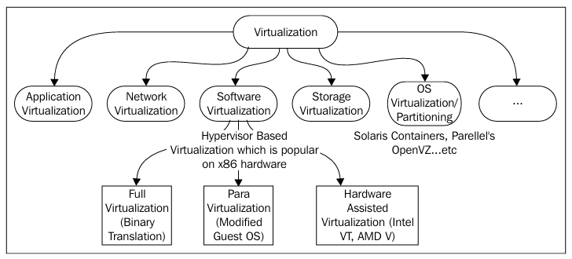
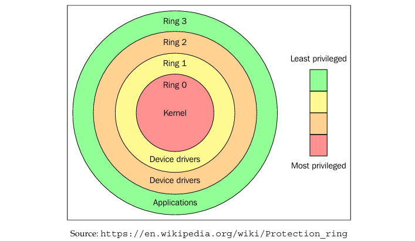
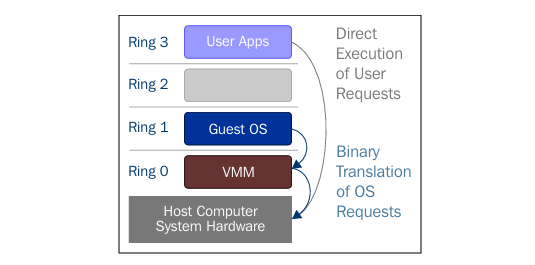
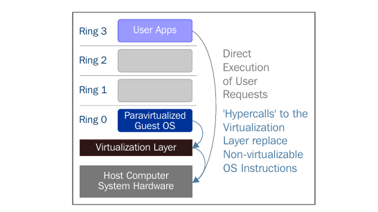
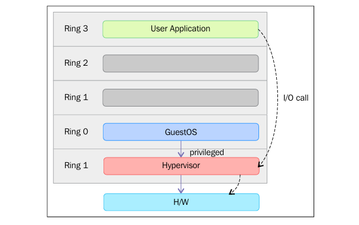
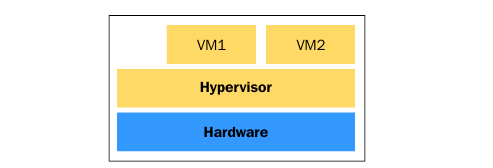
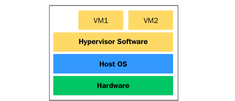
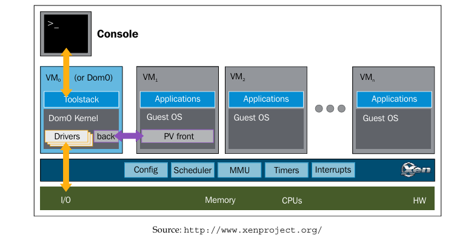

# Understanding Linux Virtualization

### 1. What is Virtualization

> Virtualization (short for virtualization technology) is the function of physical hardware that is presented to an operating system.
>
> The physical system that runs the virtualization software is called a host.  
> The virtual machines installed are call guests. 

---

### 2. Types of Virtualization

> Virtualization can happen to any of the components: hardware, network, storage, application, access, ..

---

### 3. Advantages of Virtualization

- **Server Consolidation (Hợp nhất máy chủ):** Reduce physical server, networking stack components, physical components -> power savings. Help with energy utilization by provising vm with the exact amount of CPU, mem, storage.

- **Service Isolation (Cô lập dịch vụ):** Consolidating many of virtual machines across fewer physical server -> application isolation and remove compatibility issues, simplify administration of services.

- **Faster Server Provisioning (Cung cấp máy chủ nhanh chóng):** Sprawn vm from prebuilt images (template) or snapshots. Not to worry about physical resource configuration.

- **Disaster Recovery (Khôi phục sau sự cố):** Allow up-to-date snapshoots. Virtualization offers vm migration -> move vm in data center.

- **Dynamic Load Balancing (Cân bằng tải động):** (depend on the policy) vm overultilizing the resources can be moved to underultilizing servers.

- **Faster Dev and Test Env (Phát triển và thử nghiệm nhanh):** Enable rapid deployment by isolating the application in a known and controlled environment.

- **Improved System Reliability and Secure (Cải thiện độ tin cậy và bảo mật):** Virtualization adds a layer of abstraction between the vm and the physical hardware, helps reduce risks caused by the infection.

- **OS Independence or a reduced hardware vendor lock-in (Độc lập hệ điều hành và giảm phụ thuộc vào nhà cung cấp):** VM don't care about the hardware they run on -> more flexibility when it comes to the server equipment choosing

### 4. OS Virtualization (Ảo hóa HĐH)/Partitioning (Phân vùng)

Ảo hóa HĐH cho phép máy chủ vật lý chạy nhiều phiên bản hệ điều hành độc lập, gọi là các container. Tất cả các máy ảo/container được cấp riêng các không gian độc lập về hệ thống tệp tin, tiến trình, bộ nhớ và thiết bị.

> This technique allows a physical server to run multiple isolated operating system instances, called **containers**. 
> VMs have their own file system, processes, memory, devices, and so on.

**Advantages:** 
  - Chuyển đổi phân vùng nhanh (Fast switching from one partition to another).
  - Hệ điều hành máy chủ không cần phải tốn tài nguyên để giả lập các giao diện lời gọi hệ thống (system call interfaces).

**Disadvantage:** Tất cả các container phải dùng chung nhân hệ điều hành với máy chủ vật lý, do đó không thể ảo hóa một hệ điều hành khác loại.

> The host operating system does not need to emulate system call interfaces for operating systems that differ from it.

#### Protection Rings

The mechanisms that protect data or faults based on the security enforced when accessing the resources in a computer system.

Ring 0 has the most privileges and interacts directly with physical hardware.  
Ring 1 and 2 are mostly unused.  
Applications run in Ring 3.  
Ring 0 is called the kernel mode/supervisor mode and Ring 3 is the user mode.

Due to the fact that only one kernel can run in Ring 0 at a time, the guest operating systems have to run in another ring with fewer privileges or have to be modified to run in user mode. This has resulted in a couple of virtualization methods called full virtualization and paravirtualization.

#### Full Virtualization

Ảo hóa toàn phần cho phép hệ điều hành khách (Guest OS) hoạt động mà không cần phải thực hiện bất kỳ sửa đổi nào đối với nhân (kernel).

Trong kiến trúc x86, Guest OS chạy ở Ring 1, trong khi (VMM) chạy ở Ring 0. Để giải quyết các xung đột khi Guest OS thực thi privileged instructions ở Ring 1, ảo hóa toàn phần sử dụng kỹ thuật Biên dịch nhị phân (Binary Translation).  

Các chỉ thị nhạy cảm từ Guest OS sẽ được phát hiện tại thời điểm chạy, sau đó được thông dịch, viết lại và thay thế bằng các lệnh bẫy (traps). Từ đó, VMM thực hiện giả lập các hoạt động CPU này bằng phần mềm.

> When the guest kernel executes privileged operations, the VMM provides the CPU emulation to handle and modify the protected CPU operations

**Advantages:** Cài đặt trực tiếp các HĐH mà không cần can thiệp hay chỉnh sửa mã nguồn của hệ điều hành đó để tương thích với hypervisor/VMMs.

> don't have to alter the guest kernel to run on a VMM.

**Disadvantages:** Việc thực hiện Binary Translation và giả lập tài nguyên bằng phần mềm tạo ra một gánh nặng xử lý cho CPU -> hiệu năng kém.

> this causes **performance overhead**

#### Paravirtualization

Ảo hóa bán phần là một phương pháp ảo hóa hiệu năng cao, trong đó Guest OS được sửa đổi mã nguồn để chủ động nhận biết và tương thích trực tiếp với lớp hypervisor.

> the guest operating system needs to be modified in order to allow those instructions to access Ring 0.

Cơ chế **Hypercalls**: Các chỉ thị hệ thống nhạy cảm hoặc không thể ảo hóa trực tiếp (non-virtualizable instructions) ở Ring 0 sẽ được thay thế bằng các lời gọi đặc biệt gọi là "hypercalls". Những lời gọi này sẽ giao tiếp trực tiếp với giao diện API do hypervisor/VMM cung cấp, yêu cầu lớp ảo hóa này thực hiện tác vụ phần cứng thay cho nhân của Guest OS.

> the hypervisor provides an API and the OS of the guest virtual machine calls that API which require host operating system modifications. Privileged instruction calls are exchanged with the API functions provided by the VMM. In this case, the modified guest operating system can run in ring 0.

**Advantages:** Loại bỏ được Binary Translation, giúp ảo hóa bán phần đạt được hiệu năng mạnh mẽ (near-native performance).

**Disadvantages:** Do đòi hỏi phải can thiệp và chỉnh sửa sâu vào mã nguồn của nhân hệ điều hành khách, phương pháp này chỉ áp dụng được với các hệ điều hành mã nguồn mở (như Linux) và đi kèm sự hỗ trợ phần mềm thích hợp **(tương thích HĐH kém)**.

### 5. Hardware Assisted Virtualization

Ảo hóa hỗ trợ phần cứng là phương pháp ảo hóa được thiết kế để kết hợp hiệu quả giữa tính năng ảo hóa toàn phần với các khả năng xử lý trực tiếp của phần cứng.

**Ring -1** là nơi lớp hypervisor/VMM vận hành, Guest OS chạy ở Ring 0 -> Guest OS truy cập trực tiếp tài nguyên.

> VMM can run at the newly introduced privilege level, Ring -1, with the guest operating systems running on Ring 0.

### 6. VMM/Hypervisor

VMM (Virtual Machine Monitor - Bộ giám sát máy ảo) hay Hypervisor là một phần mềm, firmware hoặc phần cứng chịu trách nhiệm khởi tạo, giám sát và vận hành các máy ảo (virtual machines - VMs).

> the VMM or hypervisor is a piece of software that is responsible for monitoring and controlling virtual machines or guest operating systems.

Chức năng chính:
  - Quản lý và cấp phát tài nguyên (providing virtual hardware): VMM kiểm soát tài nguyên phần cứng (CPU, bộ nhớ vật lý, chuyển dịch bộ nhớ, ánh xạ I/O) và phân bổ cho các Guest OS dựa trên cấu hình đã thiết lập.

  - Quản lý vòng đời máy ảo (VM Lifecycle Management): Đảm nhận toàn bộ quy trình từ khởi tạo phần cứng ảo, chạy, tạm dừng, tắt, cho đến di trú (VM migration).
  
  - Đảm bảo tính đa nhiệm độc lập (run multiple guests OS): Cho phép chạy đồng thời nhiều máy ảo (sử dụng cùng một hệ điều hành hoặc các hệ điều hành khác nhau) trên một nền tảng phần cứng mà không lo ngại xung đột.
  
  - Thực thi chính sách quản trị (defining policies): Thiết lập các quy chuẩn, quyền truy cập và chính sách bảo mật cho toàn bộ môi trường ảo hóa.

**Type 1 Hypervisors (Bare-metal, Embedded, hoặc Native Hypervisor):**

Cài đặt trực tiếp trên hệ thống bare-metal và sẵn sàng khởi tạo máy ảo ngay lập tức.

> A Type 1 hypervisor directly interacts with the system hardware; it does not need any host operating system.

Ưu điểm: Kích thước gọn nhẹ, tối ưu tài nguyên tối đa cho máy ảo, bảo mật cao (sự cố ở một máy ảo không ảnh hưởng đến các máy ảo khác) và tạo ra ít suy hao hiệu năng.

Nhược điểm: Khó tùy biến sâu, thường không cho phép cài đặt các ứng dụng hoặc driver từ bên thứ ba.

**Type 2 Hypervisors (Hosted Hypervisor):**

Hoạt động giống như một ứng dụng/phần mềm chạy trên nền tảng của một hệ điều hành máy chủ (Host OS). Phụ thuộc hoàn toàn vào hệ điều hành máy chủ để quản lý phần cứng và thực hiện các tác vụ ảo hóa.

> Type 2 hypervisors are dependent on the host operating system for their operations.

Ưu điểm: Khả năng tùy biến linh hoạt, hỗ trợ dải thiết bị phần cứng cực kỳ rộng lớn do được thừa hưởng trực tiếp từ hệ điều hành máy chủ bên dưới.

### 7. XEN

Xen là một trong những giải pháp ảo hóa mã nguồn mở hàng đầu trên hệ điều hành Linux.

Chế độ ảo hóa và khả năng tương thích phần cứng:
  - Hỗ trợ đa chế độ: Xen có thể vận hành linh hoạt ở cả hai chế độ ảo hóa bán phần (paravirtualization - PV) và ảo hóa toàn phần hỗ trợ phần cứng (HVM). Chế độ HVM cho phép chạy các hệ điều hành khách nguyên bản mà hoàn toàn không cần chỉnh sửa nhân. 

    > Xen can operate on both para virtualization and Hardware-assisted or Full Virtualization (HVM), which allow unmodified guests.

  - Hỗ trợ kiến trúc CPU đa dạng: Trình giám sát Xen (Xen hypervisor) đã được chuyển cổng (port) thành công lên nhiều dòng vi xử lý khác nhau như Intel IA-32/64, x86_64, PowerPC, ARM, và MIPS.

**Kiến trúc phân tầng: Domains (Dom 0 và Dom U)**
  - Xen quản lý các hệ điều hành khách dưới dạng các phân vùng được gọi là Domains.
    > Xen hypervisor runs guest operating systems called Domains.

  - **Dom 0 (Privileged Domain / Máy ảo đặc quyền):** bắt buộc phải khởi động đầu tiên trong hệ thống. Dom 0 có quyền truy cập trực tiếp vào phần cứng vật lý. Sở hữu một ngăn xếp điều khiển (control stack) để quản lý các máy ảo khác (tạo mới, cấu hình, hủy bỏ) và thiết lập đường truyền giao tiếp phần cứng cho các máy ảo thông qua các driver ảo (virtual drivers).
    > Dom 0 aka the privileged domain or the special guest and has extended capabilities.

  - **Dom U (Unprivileged Domain / Máy ảo không đặc quyền):** là các máy ảo thông thường của người dùng chạy trên hệ thống. Dom U không có đặc quyền truy cập trực tiếp vào phần cứng mà phải hoạt động thông qua sự kiểm soát và các driver ảo do Dom 0 thiết lập.
    > Dom Us are the unprivileged domains or guest system.

