# KVM - Kernal-based Virtual Machine

### 1. Introduction to KVM

KVM (Kernel-based Virtual Machine) là công nghệ ảo hóa mã nguồn mở hiện đại nhất hiện nay, được thiết kế để tận dụng tối đa các phần mở rộng ảo hóa phần cứng thế hệ mới (như Intel VT-x và AMD-V).

**Nguyên lý hoạt động:**
KVM được tích hợp trực tiếp vào hạt nhân Linux dưới dạng các mô-đun có thể nạp được (loadable kernel modules):
  - Mô-đun chung `kvm.ko` cung cấp các khả năng ảo hóa cốt lõi

  - Mô-đun đặc thù phần cứng là kvm-intel.ko (nếu CPU hỗ trợ cờ vmx của Intel VT-x) hoặc kvm-amd.ko (nếu hỗ trợ cờ svm của AMD-V).

Khi các mô-đun này được nạp vào hệ thống, chúng sẽ lập tức chuyển Linux kernel tiêu chuẩn thành một hypervisor. Nhờ đó, KVM thừa hưởng toàn bộ sức mạnh tối ưu hóa sẵn có từ Linux kernel, từ cơ chế quản lý bộ nhớ, bộ lập lịch (scheduler), kiến trúc NUMA cho tới công nghệ gộp trang bộ nhớ trùng lặp KSM (Kernel Same Page Merging).

Bản thân KVM không phải là một hypervisor hoàn chỉnh độc lập. KVM chỉ chịu trách nhiệm tối ưu hóa và tăng tốc phần cứng, cho phép máy ảo thực thi mã trực tiếp trên CPU vật lý với tốc độ tiệm cận máy thật, hoàn toàn không có khả năng tự mô phỏng các thiết bị ngoại vi.

Để giải quyết vấn đề này, KVM bắt buộc phải kết hợp với **QEMU (Quick Emulator)** – một phần mềm mô phỏng phần cứng chạy ở không gian người dùng (user space)

QEMU đảm nhận nhiệm vụ giả lập toàn bộ phần cứng cho máy ảo (như bo mạch chủ, đĩa cứng, card mạng, VGA, PCI, cổng USB...). Phiên bản QEMU đã được sửa đổi và tối ưu riêng cho KVM (được gọi là qemu-kvm) sẽ giao tiếp trực tiếp với KVM để điều phối tài nguyên. 

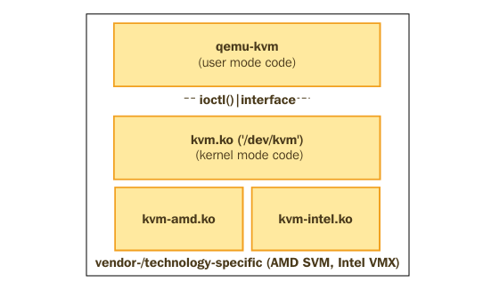

Khi chạy dưới mô hình này, mỗi máy ảo KVM thực chất là một tiến trình Linux thông thường trên máy chủ, và các bộ vi xử lý ảo (vCPUs) chính là các luồng POSIX (POSIX threads) được quản lý trực tiếp bởi bộ lập lịch của hệ điều hành Linux.

### 2. Getting Acquainted With libvirt and Its Implementation

`libvirt` là một lớp quản lý trung gian bổ sung (extra management layer) có nhiệm vụ cung cấp một giao diện ổn định và thống nhất để quản lý các máy ảo chạy trên nhiều loại hypervisor khác nhau.

`libvirt` hoạt động đồng thời dưới dạng một giao diện lập trình ứng dụng (API), một dịch vụ nền chạy ngầm (daemon mang tên `libvirtd`), và một công cụ quản trị.

Các công cụ tương tác phổ biến:
  - Giao diện đồ họa (GUI): `virt-manager` và GNOME boxes.
  - Giao diện dòng lệnh (CLI): Công cụ `virsh` (được cung cấp bởi gói cài đặt `libvirt-client`).
  - Các nền tảng quản trị cấp cao: oVirt, OpenStack.

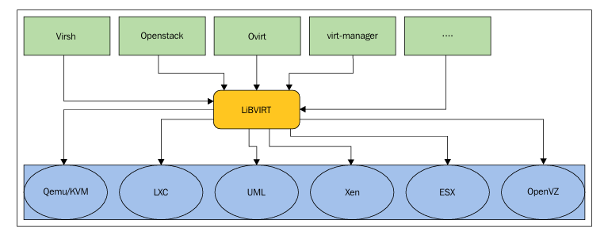

**Connection URIs:**
 
libvirt tích hợp sẵn khả năng quản lý máy ảo từ xa thông qua mạng. Client (như virt-manager hoặc virsh) sẽ giao tiếp với daemon libvirtd dựa trên chuỗi URI kết nối (Connection URI) được truyền vào.

Kết nối cục bộ (Local URIs):
  - `qemu://xxxx/system` kết nối cục bộ dưới quyền 'root' đến daemon để quản lý các máy ảo hệ thống (system-wide).

  - `qemu://xxxx/session` kết nối cục bộ dưới quyền "normal user" để quản lý các máy ảo riêng tư của chính họ.

Kết nối từ xa (Remote URIs): Cấu trúc tổng quát là `driver[+transport]://[username@][hostname][:port]/[path] [?extraparameters]`.  
Ví dụ lệnh virsh kết nối qua giao thức SSH: `$ virsh --connect qemu+ssh://root@remoteserver.yourdomain.com/system list --all`


sudo apt -y install bridge-utils cpu-checker libvirt-clients virtinst virt-manager libvirt-daemon-system qemu-system-x86 qemu-utils

### 3. KVM LAB

**Cài KVM**

```bash
sudo apt update
sudo apt -y install bridge-utils cpu-checker libvirt-clients virtinst virt-manager libvirt-daemon-system qemu-system-x86 qemu-utils qemu-kvm
```

**Kiểm tra KVM**:
```bash
kvm-ok
```

**Khởi động chạy KVM**
```bash
systemctl start libvirtd
systemctl enable libvirtd
``` 

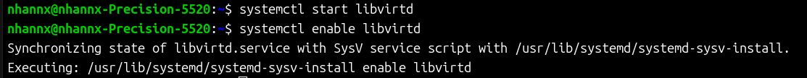

**Kiểm tra xem quá trình cài đặt KVM đã thành công chưa**

```bash
virsh or sudo systemctl status libvirtd
```

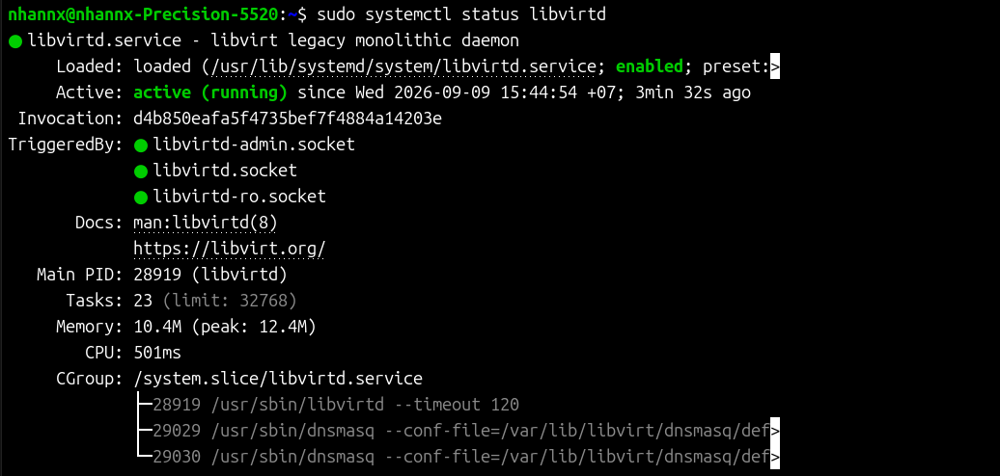

**Tạo máy ảo VM**

**Khởi tạo ổ cứng ảo(Virtual Storage) cho VM**

```bash 
sudo qemu-img create -f qcow2 /var/lib/libvirt/images/tribbie.qcow2 10G
```
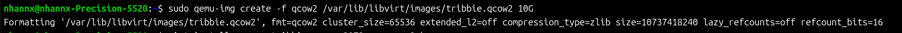

**Cấu hình cho máy ảo**

```bash
virt-install \
--name tribbie \
--ram 2048 \
--vcpus 2 \
--disk path=/var/lib/libvirt/images/tribbie.qcow2,format=qcow2 \
--cdrom /var/lib/libvirt/file-iso/ubuntu-24.04.4-live-server-amd64.iso \
--network network=default \
--graphics vnc
```

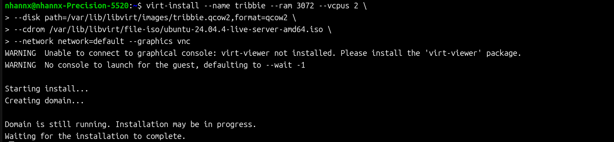
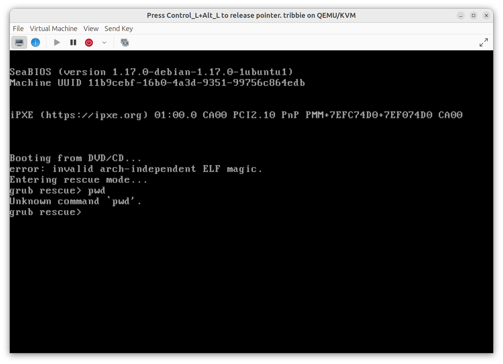
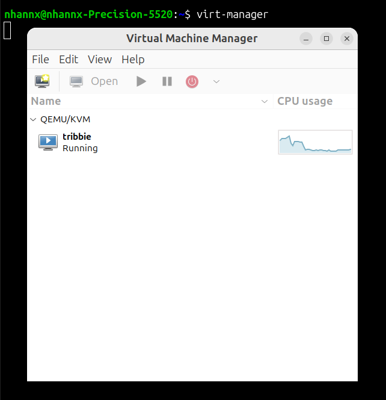

**Một số lệnh làm việc giao diện CLI với VM**

**Hiển thị danh sách máy ảo**:

```bash
virsh list --all
```
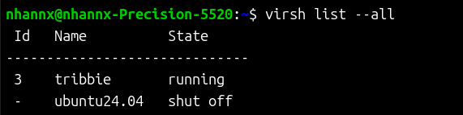

**Bật VM**
```bash
virsh start <tên_máy_ảo>
```
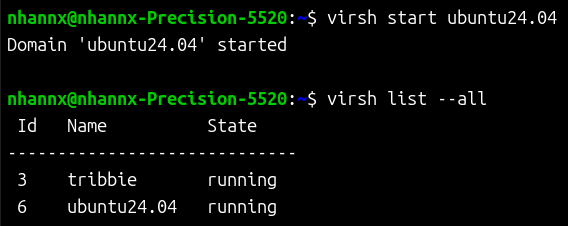

**Reboot VM**
```bash
virsh reboot <tên_máy_ảo>
```

**Tắt VM**
```bash
virsh shutdown <tên_máy_ảo>
```

**Xóa máy ảo**
```bash
virsh undefine <tên_máy_ảo>
```

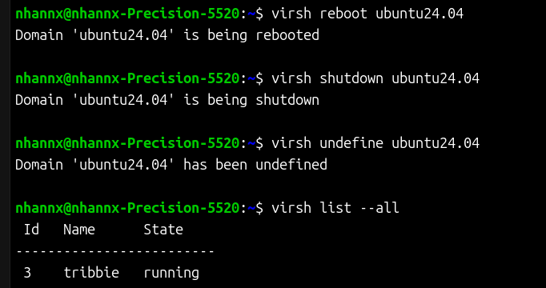

- **Tạo snapshot**
```bash
virsh snapshot-create-as --domain tên_máy --name tên_bản_snapshot --description "mô tả bản snapshot"
```

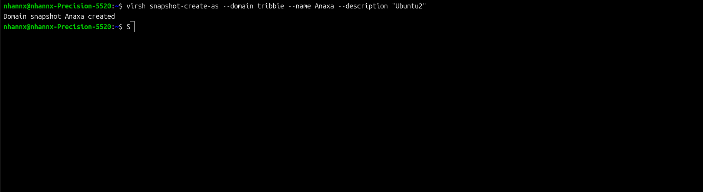

**Xem danh sách các bản snapshot trên 1 VM**
```bash
virsh snapshot-list <tên_máy_ảo>
```

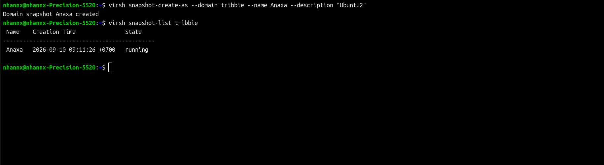

**Xem thông tin chi tiết của bản snapshot**

```bash
virsh snapshot-info --domain <tên_máy_ảo> --snapshotname <tên_bản_snapshot>
```

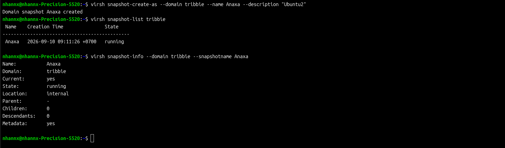

**Revert để chạy lại một bản snapshot đã tạo**
```bash
virsh snapshot-revert <tên_máy_ảo> <tên-bản-snapshot>
```

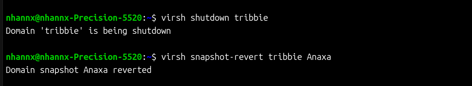

**Xóa 1 bản snapshot**

```bash
virsh snapshot-delete --domain <tên_máy_ảo> --snapshotname <tên_bản_snapshot>
```
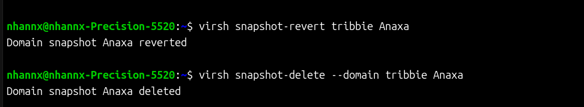

**Sửa thông tin CPU hoặc memory**

```bash
virsh edit <tên_VM>
```

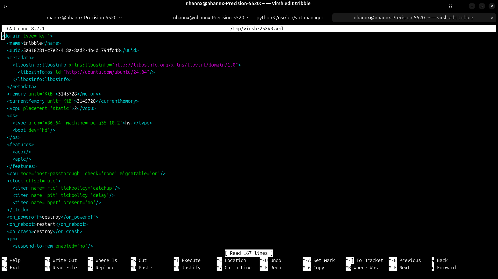


**Xem thông tin chi tiết về file disk của VM**

```bash
qemu-img info <đường_dẫn_file-disk>
```

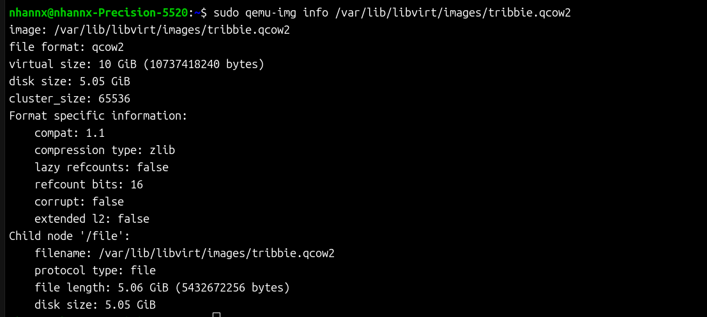

**Xem thông tin cơ bản của 1 VM**

```bash
virsh dominfo <tên_VM>
```

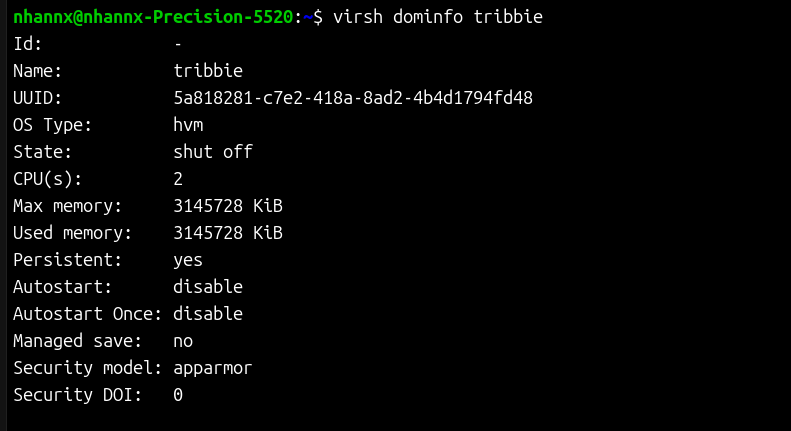
