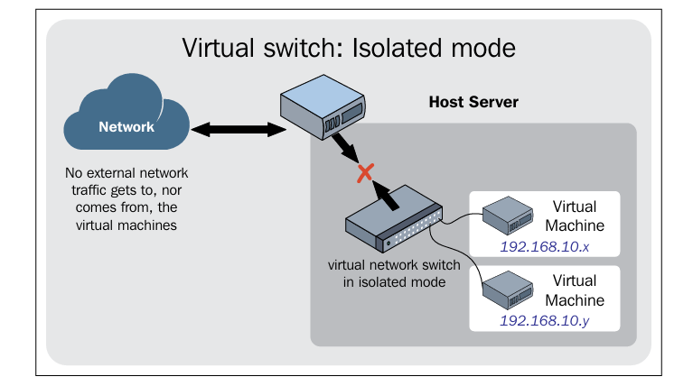
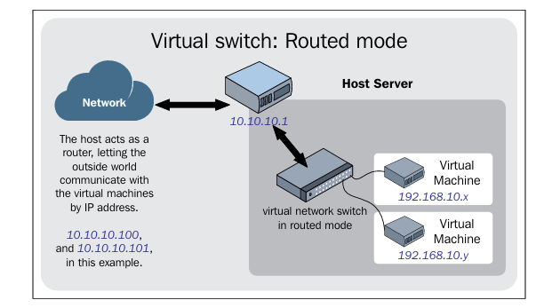
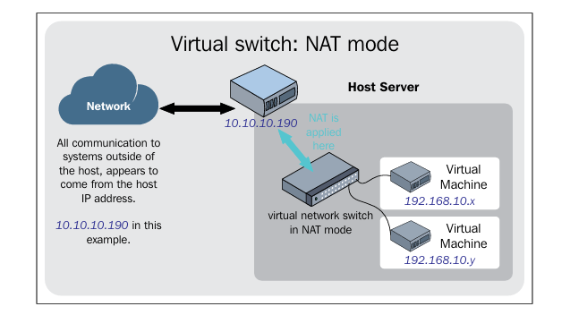

# Network

Hạ tầng mạng trong môi trường ảo hóa được chia làm hai loại chính: **hạ tầng vật lý** (gồm switch vật lý, cáp, card mạng...) và **hạ tầng ảo** (gồm các thiết bị mô phỏng hoặc ảo hóa bán phần bên trong máy ảo phối hợp với các thiết bị ảo được tạo trên host).

### 1. Virtual Networking Components

**Virtual Network Switch**, aka the **Bridge**.  

Linux bridge có vô số cổng ảo kết nối với các VMs.
>The Linux bridge, there are unlimited numbers of virtual ports to which the interfaces to virtual machines are attached.

Tương tự như một switch vật lý, Linux Bridge sở hữu một bảng MAC để tự động học địa chỉ MAC từ các gói tin nó nhận được, lưu trữ chúng và chuyển tiếp gói tin (frames) chính xác đến các cổng ảo (virtual ports) của máy ảo.

> Bridge learns the MAC addresses from the packets it receives and stores those MAC addresses in the MAC table. The packet (frames) forwarding decisions are taken based on the MAC addresses

**TUN/TAP devices**

Thiết bị TAP đóng vai trò giống như một "sợi cáp mạng ảo" giúp truyền tải Ethernet frames giữa máy ảo và switch ảo.
  - TUN (Tunnel) mô phỏng thiết bị lớp mạng (Layer 3 - OSI), xử lý các gói tin IP và thường được dùng cho mục đích định tuyến.

  - TAP (Network Tap) mô phỏng thiết bị lớp liên kết dữ liệu (Layer 2 - OSI), xử lý các Ethernet frames, được dùng để tạo network bridge.

> TUN is used with routing, while TAP is used to create a network bridge

### 2. Virtual Networking Using Libvirt

#### Isolated Virtual Network

Mô hình này tạo ra một mạng nội bộ kín hoàn toàn dành riêng cho các máy ảo.

Các máy ảo kết nối vào đây chỉ có thể giao tiếp với nhau và giao tiếp với máy chủ vật lý (hypervisor), hoàn toàn không thể gửi hay nhận lưu lượng từ mạng vật lý bên ngoài. 

> In this configuration, only the virtual machines which are added to this network can communicate with each other.

#### Routed Virtual Network (Mạng định tuyến)

Các máy ảo được kết nối trực tiếp với mạng vật lý bên ngoài thông qua các quy tắc định tuyến (routing rules) được thiết lập trên hypervisor. Máy chủ đóng vai trò là một router trung gian chuyển tiếp gói tin, cho phép mạng bên ngoài giao tiếp trực tiếp với máy ảo bằng địa chỉ IP riêng.

> the virtual network is connected to the physical network using the IP routes specified on the hypervisor.

#### NATed Virtual Network (Default)

Là mô hình mặc định của libvirt (sử dụng bridge virbr0), cung cấp kết nối mạng một chiều đi ra ngoài (outbound) cho các máy ảo dựa trên mạng của máy chủ vật lý, nhưng chặn hoàn toàn các thực thể bên ngoài truy cập ngược lại vào máy ảo.

>  This mode allows the virtual machines to communicate with the outside network, also allows communication between the hypervisor and the virtual machines. The major drawback is that none of the systems outside the hypervisor can reach the virtual machines.

#### Bridged Network

Đây là giải pháp tiêu chuẩn được áp dụng trong hầu hết các môi trường production.

Bằng cách liên kết trực tiếp một card mạng vật lý của máy chủ (hoặc VLAN, Bond interface) vào một bridge ảo, máy ảo sẽ xuất hiện trên mạng vật lý như một thiết bị độc lập.

Máy ảo sẽ nhận IP trực tiếp từ DHCP vật lý và có thể dễ dàng truy cập trực tiếp từ ngoài vào, thích hợp khi chạy các dịch vụ server hoặc webserver.