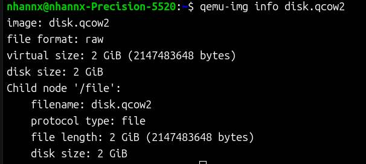
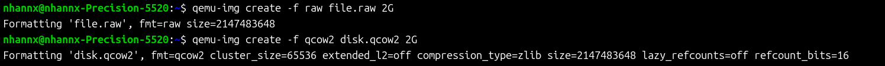

# Storage

Trong KVM, hạ tầng lưu trữ được chia làm hai loại lớn: Lưu trữ vật lý (thiết bị lưu trữ thực tế như SAN, iSCSI, LVM, hệ thống tệp...) và Lưu trữ ảo (các thiết bị lưu trữ mô phỏng hoặc ảo hóa bán phần bên trong máy ảo phối hợp với các tệp ảnh đĩa ảo trên máy chủ)

<!-- ### 1. Unmanaged Storage (Lưu trữ không được kiểm soát)

Là dạng lưu trữ không được kiểm soát hoặc giám sát trực tiếp bởi libvirt. Quản trị viên có thể sử dụng trực tiếp bất kỳ tệp ảnh đĩa ảo (disk image) hay thiết bị khối (block device - như phân vùng ổ cứng vật lý /dev/sdb1, LVM logical volume) hiện có trên máy chủ để gắn trực tiếp vào máy ảo làm ổ đĩa. -->

**Phương thức phân bổ đĩa (Disk Allocation formats):**

  - Thick Provisioning (Cấp phát trước / Preallocated): Toàn bộ dung lượng đĩa ảo được khởi tạo và chiếm dụng ngay lập tức trên máy chủ vật lý tại thời điểm tạo. 
    
    - Ưu điểm: Hiệu năng ghi (write performance) nhanh nhất, quá trình ghi diễn ra trực tiếp mà không tốn thời gian cho việc cấp phát thêm các khối đĩa (clusters/blocks) mới, phù hợp cho các tác vụ I/O cường độ cao.

    - Nhược điểm: Tốn không gian lưu trữ vật lý ngay từ đầu, có thể gây lãng phí dung lượng đĩa nếu máy ảo không sử dụng hết lượng tài nguyên đã cấp.

  - Thin-Provisioning (Cấp phát động / Sparse / On-demand): Không gian đĩa vật lý chỉ được cấp phát cho máy ảo khi có dữ liệu thực tế được ghi vào (tối đa bằng dung lượng đĩa được cấu hình). 
  
    - Ưu điểm: Tối ưu hóa không gian lưu trữ, cho phép vượt ngưỡng cấp phát (storage overcommitment - tổng dung lượng đĩa cấp cho các máy ảo có thể lớn hơn dung lượng đĩa vật lý thực tế của máy chủ), thích hợp cho các tác vụ kkhông yêu cầu cường độ I/O quá lớn. 

    - Nhược điểm: Tốc độ ghi ban đầu chậm hơn do hệ thống phải thực hiện thao tác cấp phát khối đĩa mới khi máy ảo ghi dữ liệu. Ngoài ra, có rủi ro làm tràn đĩa vật lý của host nếu không giám sát dung lượng cẩn thận.

<!-- ### 2. Managed Storage 

Toàn bộ tài nguyên lưu trữ được kiểm soát trực tiếp bởi libvirt thông qua  **Storage Pools** (Kho lưu trữ) và **Storage Volumes** (Phân vùng lưu trữ ảo).

**Storage Pool** (Kho lưu trữ) -->

**Các định dạng ổ đĩa (Disk Formats):**

**Raw:**

Là bản sao chính xác theo từng byte (byte-for-byte) của cấu trúc đĩa gốc và hoàn toàn không chứa thêm siêu dữ liệu (metadata). Do không có cấu trúc siêu dữ liệu bổ sung, đĩa raw tạo ra rất ít chi phí xử lý (overhead) và mang lại hiệu năng I/O tối ưu nhất, tiệm cận với tốc độ đĩa vật lý (near-native performance). Định dạng này rất thích hợp cho các máy ảo chạy ứng dụng đòi hỏi cường độ I/O cao.

Hạn chế: Thiếu các tính năng như chụp ảnh đĩa nội bộ (internal snapshots) hay nén dữ liệu.

Cơ chế cấp phát: Hỗ trợ cả hai phương thức thick-provisioning lẫn thin-provisioning.

**Qcow2 (QEMU Copy-On-Write v2):** 

Là định dạng đĩa ảo thế hệ thứ hai được thiết kế tối ưu riêng cho KVM và Cloud, hỗ trợ nhiều tính năng quản lý đĩa nâng cao bao gồm tệp đĩa liên kết chỉ đọc (backing files), chụp ảnh đĩa nội bộ và ngoại vi (internal & external snapshots), nén dữ liệu, mã hóa, cũng như cấp phát đĩa theo nhu cầu (thin provisioning). Đây là định dạng được khuyến khích sử dụng mặc định khi máy ảo cần đến các tính năng linh hoạt như snapshot hoặc nhân bản nhanh từ template.

QCOW2 sử dụng cơ chế Copy-On-Write (COW), dữ liệu gốc không bị thay đổi trực tiếp; khi có ghi dữ liệu mới, hệ thống sẽ tạo block mới để lưu thay đổi.

Do phải thông qua lớp xử lý định dạng (format layer) để điều phối các khối đĩa, qcow2 có sự suy hao hiệu năng nhỏ so với raw khi thực hiện các thao tác ghi.

**ISO (International Organization for Standardization):**

Là định dạng image chỉ đọc, sử dụng để lưu trữ các đĩa cài đặt hệ điều hành và phần mềm bên trong các kho chứa đĩa (ISO image library) của libvirt.

Ưu điểm: Việc đọc và cài đặt từ tệp ISO lưu trên ổ cứng nhanh hơn và hiệu quả hơn nhiều so với việc chuyển tiếp (passthrough) ổ đĩa CD/DVD vật lý từ máy chủ vào máy ảo. Các tệp ISO này sau khi đưa vào thư viện có thể gắn trực tiếp vào máy ảo để cài đặt hệ điều hành, phần mềm hoặc nâng cấp hệ thống.

### Công cụ quản lý và chuyển đổi Image 

`qemu-img` là công cụ dòng lệnh thao tác với các tệp đĩa ảo

**Xem thông tin đĩa (Virtual Size & Disk Size):** 

`$ qemu-img info <image_file>`

**Tạo đĩa mới:** 

`$ qemu-img create -f <image_format> <tên_file> <dung_lượng>`

**Tạo đĩa liên kết từ đĩa mẫu:** 

`$ qemu-img create -b <backing_file> -f qcow2 <overlay_file>.`

**Chuyển đổi định dạng đĩa**

`$ qemu-img convert -f <input_image_format> -O <output_image_format> <input_file> <output_file>`

**Kiểm tra tính toàn vẹn:** 

`$ qemu-img check <image_file>`