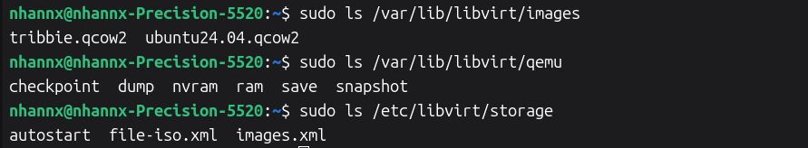
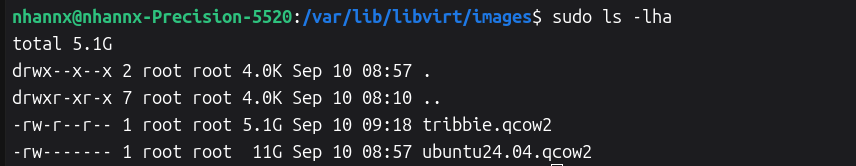
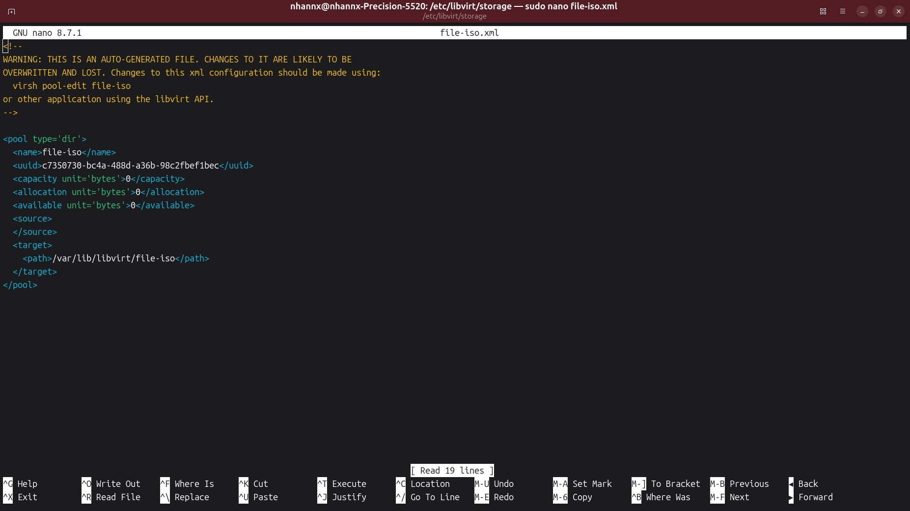
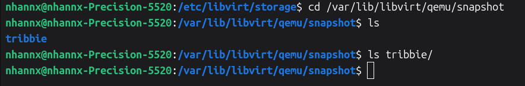

# Tổ chức file trong KVM

|Đặc điểm| `/etc/libvirt/qemu/`| `/var/lib/libvirt/qemu/`|
|--------|---------------------|-------------------------|
| Loại dữ liệu | Cấu hình (Configuration) | Trạng thái (Runtime State) |
| Định dạng| Tệp XML| "Tệp Log, Socket, RAM dump, NVRAM"| 
| Mục đích | Định nghĩa máy ảo là gì?| Máy ảo đang làm gì và chạy ra sao?| 
| Khi nào xóa?| Chỉ khi bạn undefine (xóa) máy ảo.| Thường chứa dữ liệu tạm thời khi máy đang chạy.|

### 1. Cấu hình Máy ảo và Mạng (XML Configurations)

Thư mục chứa XML máy ảo: ```/etc/libvirt/qemu/```. Mỗi máy ảo (Guest Domain) được định nghĩa bằng một tệp XML riêng biệt (ví dụ: vm01.xml) chứa toàn bộ tham số phần cứng ảo như vCPU, RAM, đĩa ảo và card mạng

Thư mục con ```/etc/libvirt/qemu/autostart/``` chứa các liên kết mềm (symlinks) trỏ tới các tệp XML của những máy ảo được thiết lập tự động khởi động cùng hệ thống

Thư mục chứa XML mạng ảo: ```/etc/libvirt/qemu/networks/```. Chứa các tệp XML định nghĩa mạng ảo do libvirt quản lý (như default.xml hay isolated.xml). Các mạng kích hoạt tính năng tự khởi động cũng được liên kết vào thư mục con ```/etc/libvirt/qemu/networks/autostart/```.


### 2. Cấu hình và Quản lý Lưu trữ (Storage Pools & Volumes)

Kho chứa đĩa ảo mặc định (Default Storage Pool): ```/var/lib/libvirt/images/```. Vị trí mặc định do libvirt khởi tạo để lưu trữ các tệp đĩa ảo (như .qcow2, .raw, hoặc tệp .iso)

Thư mục lưu đĩa tạm và trạng thái: ```/var/lib/libvirt/qemu/```. Lưu trữ các tệp ảnh đĩa được khởi tạo tự động trong quá trình triển khai (như lệnh virt-install hoặc virt-builder), cũng như các tệp lưu trạng thái tạm thời của máy ảo

Thư mục cấu hình Storage Pools: ```/etc/libvirt/storage/```. Chứa các tệp XML định nghĩa cấu hình của từng kho chứa lưu trữ (như Directory, LVM, iSCSI, NFS) do libvirt kiểm soát



Xem chi tiết các file image



file-iso.xml



Thư mục lưu các bản snapshot của VM
```/var/lib/libvirt/qemu/snapshot```

