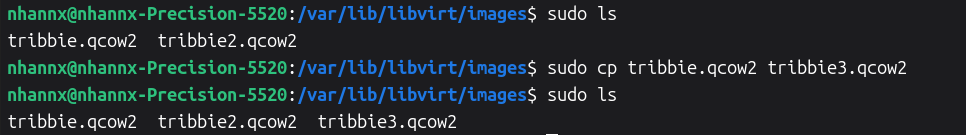
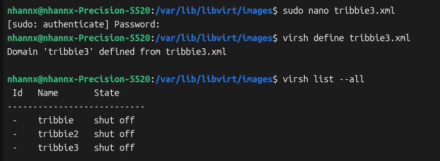
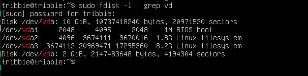
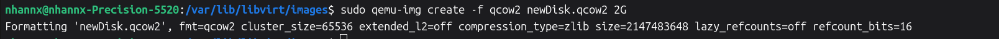
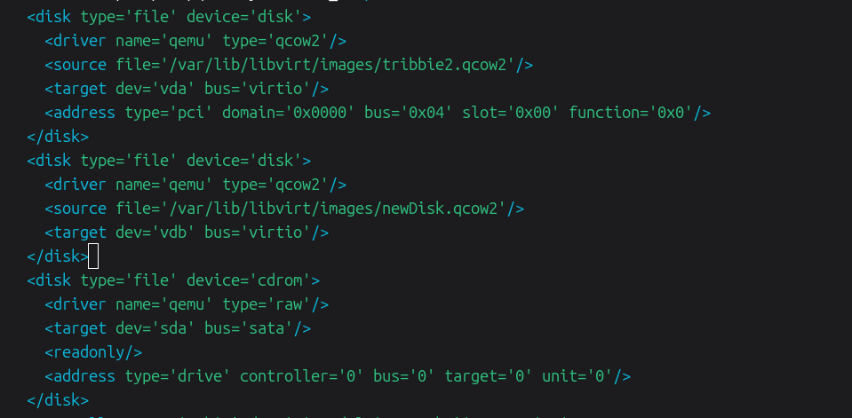
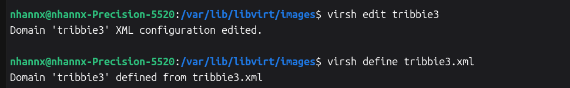
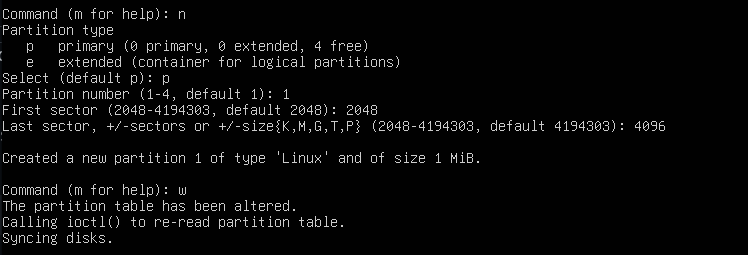
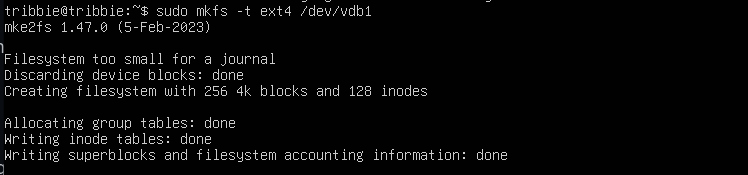

# Tìm hiểu về file XML trong KVM

## 1. Cơ bản về XML 

XML (Extensible Markup Language - Ngôn ngữ đánh dấu mở rộng) là một định dạng văn bản dùng để lưu trữ và trao đổi dữ liệu có cấu trúc giữa các hệ thống máy tính khác nhau. Nó cho phép người dùng tự định nghĩa các thẻ (tags) để mô tả dữ liệu.

Trong KVM, file XML là thành phần định nghĩa và quản lý các máy ảo (VMs) và mạng ảo. `libvirt`(daemon quản lý KVM) sử dụng các file XML này như một bản blueprint để biết cách tạo và chạy một MV hoặc một Network

Một máy ảo(VM) trong KVM có 2 thành phần chính là:

- VM's defination được lưu dưới dạng file XML và nằm trong thư mục `/etc/libvirt/qemu`
- VM's storage lưu dưới dạng file image

Các file XML trong KVM mô tả chi tiết toàn bộ cấu hình phần cứng của một máy ảo. Nó bao gồm mọi thứ từ tên, UUID, số lượng CPU, RAM cho đến các thiết bị lưu trữ, card mạng, card đồ họa,...

## 2. Các thành phần trong file domain XML của VM

- `name`: tên của VM
- `uuid`: uuid của VM
- `memory`: dung lượng RAM của VM
- `unit='KiB'`: đơn vị đo dung lượng RAM, có thể sử dụng các đơn vị khác
- `currentMemory`: dung lượng RAM hiện tại
- `vcpu`: số CPU ảo được cài đặt
- `os`: hệ điều hành đang cài đặt trên máy ảo

## 3. Tạo 1 VM bằng file domain XML

Copy file từ máy ảo đã tạo bằng  dòng lệnh CLi. 



Truy cập vào file `xml` vừa copy đổi tên cho file bằng tên máy ảo mới và thay đổi các trường dữ liệu:
- `<name>`
- `<uuid>`: (Có thể ra ngoài `sudo apt install uuid` -> `uuid`: máy tự gen 1 uuid ngẫu nhiên).
- **Disk path**: `<source file='/var/lib/libvirt/images/Castorice.qcow2'/>`
- **MAC address**
- **Machine type**: cần biết host hỗ trợ version nào, mặc định `x86_64` dùng `machine='pc-q35-noble'`
- **CPU mode**
- **Memory**



### 4 Thêm Disk vào VM 

**Kiểm tra số lượng đĩa ảo của VM**

```bash
fdisk -l | grep vd
```




**Tạo thêm 1 đĩa ảo trên host KVM**

```bash
cd /var/lib/libvirt/images
qemu-img create -f qcow2 newDisk.qcow2 3G
```


**Truy cập file `*.xml` để chỉnh sửa**

```bash
virsh edit ubuntu20.04
```

Chỉnh sửa như sau:

```bash
<disk type='file' device='disk'>
    <driver name='qemu' type='qcow2'/>
    <source file='/var/lib/libvirt/images/newDisk.qcow2'/>
    <target dev='vdb' bus='virtio'/>
</disk>
```



**Define lại  và kiểm tra**



**Phân vùng disk**

Trên VM mới thêm disk `vdb`, ta thực hiện phân vùng:

```bash
fdisk /dev/vdb
```



**Định dạng phân vùng với với hệ thống file `ext4`**

```bash
mkfs -t ext4 /dev/vdb1
```




<!-- ### 4.3 Thêm card mạng
- Check những card mạng hiện có trên 1 máy ảo 
```bash
virsh domiflist <tên_máy_ảo>
```
- Chỉnh sửa file xml của VM
- Thêm đoạn `interface` như sau vào file xml
```bash
<interface type='network'>
    <source network='hostonly'/>
    <model type='virtio'/>
</interface>
```
Trong đó:
- `interface type`: kiểu card mạng
- `source`: dải mạng mà card cắm vào

Define file xml của VM và reboot VM

### 4.4 Xóa card mạng
Ta có thể xóa card mạng bằng 2 cách:
  - Xóa trong file xml
  
```bash
  virsh detach-interface --domain demo --type network --mac 52:54:00:2c:24:cb --config
  ``` -->