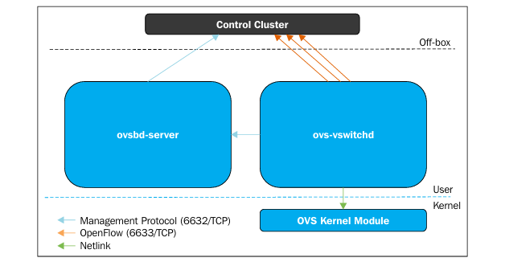

# Open vSwitch

Open vSwitch (OVS) là một switch ảo mã nguồn mở hỗ trợ giao thức OpenFlow, được thiết kế chuyên biệt cho môi trường ảo hóa KVM và điện toán đám mây. OVS được ra đời nhằm thay thế giải pháp Linux Bridge truyền thống vốn chỉ là thiết bị Lớp 2 (Layer 2) cơ bản và thiếu khả năng mở rộng.

### 1. Open vSwitch architecture

Kiến trúc của Open vSwitch tách biệt giữa mặt phẳng dữ liệu (Data Plane) và mặt phẳng điều khiển (Control Plane):

**Open vSwitch kernel module (Data Plane/Datapath)**

**User space tools (Control Plane)**

