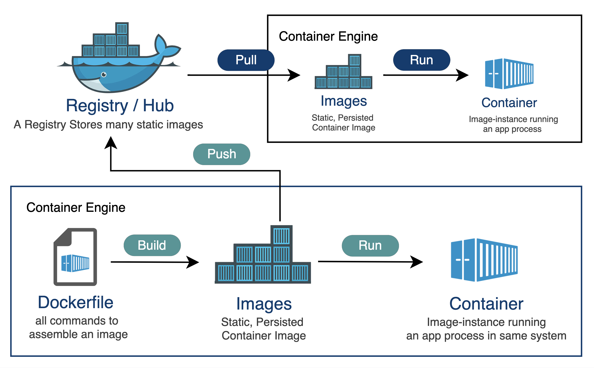
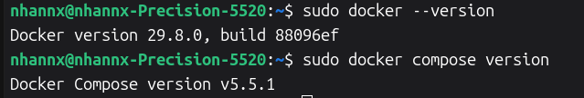
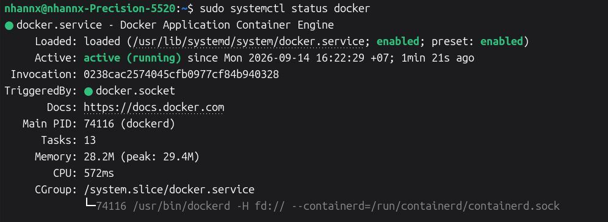
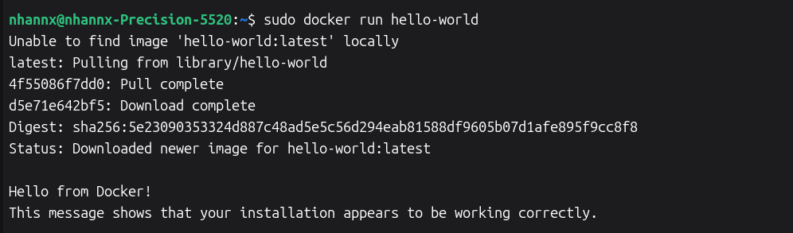
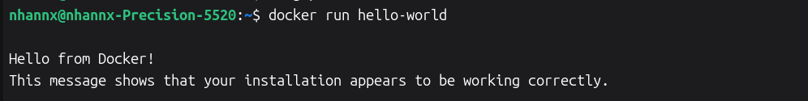
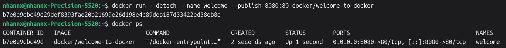

# Introduction to Docker

### 1. What is Docker

Docker là một nền tảng ảo hóa cấp hệ điều hành (OS-level virtualization) hay đóng gói ứng dụng (containerization), giúp đơn giản hóa quá trình phát triển, đóng gói và triển khai ứng dụng. Ứng dụng được chạy bên trong các môi trường cô lập gọi là container.

Các container rất nhẹ, chứa toàn bộ những thành phần cần thiết để chạy ứng dụng mà không cần phụ thuộc vào những gì đã được cài đặt trên máy chủ (host). Nhiều container có thể chạy đồng thời trên cùng một máy chủ.

Trước khi có Docker, việc triển khai ứng dụng giữa các môi trường khác nhau thường gặp lỗi do xung đột phiên bản hệ điều hành hay thư viện phụ thuộc. Docker giải quyết vấn đề này bằng cách đóng gói ứng dụng cùng toàn bộ phụ thuộc (dependencies) thành một đơn vị duy nhất, đảm bảo phần mềm hoạt động đồng nhất ở mọi nơi.

**Ưu điểm nổi bật của Docker**

- Fast, consistent delivery: Docker tạo ra môi trường chuẩn hóa phù hợp cho quy trình tích hợp và triển khai liên tục (CI/CD), giúp việc chuyển giao phần mềm từ kiểm thử sang production diễn ra nhất quán.

- Responsive deployment and scaling: Đóng gói một lần và có thể chạy linh hoạt trên máy cá nhân, máy chủ nội bộ hoặc đám mây.

- Hardware Ultilizing: Docker nhanh và nhẹ hơn so với các máy ảo dựa trên hypervisor truyền thống, giúp chạy nhiều khối lượng công việc hơn trên cùng một tài nguyên phần cứng.

- Khả năng mở rộng tốt: Phù hợp cho kiến trúc microservices và dễ dàng kết hợp với các công cụ điều phối như Kubernetes hay Docker Swarm.

### 2. Docker Architecture and Working

**Docker hoạt động theo mô hình Client – Server**

Người dùng tương tác với Docker thông qua giao diện dòng lệnh (CLI). Khi nhập lệnh, Docker Client sẽ chuyển đổi lệnh thành yêu cầu REST API. Docker Daemon nhận các yêu cầu API để quản lý container, image, network và volume.


#### 2.1. Docker Daemon

Docker Daemon chịu trách nhiệm trực tiếp tạo, khởi chạy, kiểm soát và lưu trữ toàn bộ các đối tượng Docker bao gồm Images, Containers, Networks và Volumes.

Docker Daemon (dockerd) là dịch vụ chạy ẩn (background process) đóng vai trò làm "bộ não" cốt lõi trên máy chủ Docker Host.

Daemon liên tục lắng nghe các yêu cầu REST API gửi đến từ Docker Client. Khi nhận lệnh từ client, daemon sẽ kiểm tra image cục bộ, tải từ Docker Registry nếu cần và phối hợp với thời gian thực thi (runtime) để tạo môi trường cô lập cho container.

#### 2.2. Docker Client

Docker Client chuyển đổi các lệnh thực thi thành các yêu cầu REST API. Client gửi các yêu cầu REST API tới Docker Daemon hông qua UNIX socket hoặc qua giao diện mạng (network interface).

Các lệnh Docker Client thường dùng

- `docker run`: Tạo và khởi chạy một container mới từ image.

- `docker build`: Xây dựng một Docker Image từ tệp Dockerfile.

- `docker pull`: Tải image từ kho lưu trữ (Docker Registry / Docker Hub) về máy.

- `docker ps`: Liệt kê các container đang hoạt động trên hệ thống.

#### 2.3. Docker Registries

Docker Registry là một hệ thống lưu trữ và phân phối tập trung dùng để quản lý các Docker Image. Đây là nơi lưu trữ các bản mẫu image tĩnh để người dùng hoặc hệ thống có thể tải về và khởi chạy thành các container.

**Phân loại Docker Registry**

- Public Registry (Registry công khai): Docker Hub là kho lưu trữ mặc định trên đám mây của Docker, nơi lưu trữ hàng triệu image do cộng đồng đóng góp cũng như các image chính thức (như Ubuntu, MySQL, Nginx, Python).

- Private Registry (Registry riêng tư): Các tổ chức và doanh nghiệp thường triển khai registry riêng để quản lý các image nội bộ nhằm đảm bảo tính bảo mật và kiểm soát quyền truy cập.

Trong kiến trúc Client-Server của Docker, Docker Daemon sẽ trực tiếp giao tiếp với Docker Registry để thực hiện thao tác kéo (pull) hoặc đẩy (push) image:

- `docker pull <image_name>`: Tải một image từ registry về máy cục bộ. Khi bạn chạy lệnh docker run, nếu image chưa có sẵn trên máy, Docker Daemon cũng sẽ tự động tải image đó từ registry mặc định về.

- `docker push <image_name>`: Tải một image từ máy cục bộ lên registry.

- `docker login`: Đăng nhập vào registry để xác thực quyền truy cập đối với các kho lưu trữ riêng tư (private repositories).

#### 2.4. Docker Objects

Docker Objects là các thực thể cốt lõi (mages, containers, networks, volumes, plugins,...) được tạo ra và sử dụng trong suốt quá trình vận hành Docker.



**Images**

Là một read-only template chứa các hướng dẫn để khởi tạo một Docker container.

Được xây dựng từ một tệp Dockerfile theo cơ chế phân lớp (layers), trong đó mỗi chỉ thị tạo thành một lớp giúp tối ưu hóa dung lượng và tốc độ chia sẻ

**Containers** 

Là một live/runnable instance của một Docker Image.

Mỗi container hoạt động trong một môi trường cô lập có hệ thống tệp, không gian tiến trình và mạng riêng, dựa trên các công nghệ của Linux kernel như namespaces và cgroups.

**Volumes & Storage**

Cung cấp giải pháp duy trì dữ liệu bền vững (persistence) ngoài vòng đời tạm thời của tệp tin trong container.

Volumes: Cơ chế lưu trữ do Docker quản lý trực tiếp tại một khu vực dành riêng trên máy host.

Bên cạnh Volumes, Docker còn hỗ trợ Bind Mounts (gắn trực tiếp tệp/thư mục từ máy host vào container) và tmpfs Mounts (lưu tạm thời trên bộ nhớ RAM).

**Networks**

Network cho phép các container kết nối, truyền thông tin với nhau hoặc giao tiếp với mạng bên ngoài.

Hỗ trợ nhiều loại driver mạng như Bridge (mặc định cho các container trên cùng một host), Host, Overlay (kết nối giữa các máy host trong cụm Swarm), Macvlan, và None.

**Plugins và các đối tượng khác**

Docker cung cấp khả năng mở rộng chức năng hệ thống thông qua các Plugins cũng như các đối tượng điều phối dịch vụ khác.

#### 2.5. Docker Compose

Docker Compose là một công cụ thuộc hệ sinh thái Docker, đóng vai trò như một Docker Client cho phép làm việc và quản lý các ứng dụng gồm nhiều container (multi-container applications).

Thay vì phải khởi chạy thủ công từng container riêng lẻ,có thể định nghĩa tất cả các dịch vụ (như app, database, cache) cùng toàn bộ cấu hình của chúng trong một tệp duy nhất là `docker-compose.yml`.

### 3. Docker Install (Ubuntu)

Cài đặt bằng kho lưu trữ apt

**Thiết lập kho lưu trữ apt của Docker**

1. Gỡ các package Docker cũ/xung đột (nếu có)

```bash
$ sudo apt remove docker.io docker-doc docker-compose docker-compose-v2 podman-docker containerd runc
```

2. Cập nhật package index và cài các dependency

```bash
$ sudo apt update
$ sudo apt install -y ca-certificates curl
```

3. Tạo thư mục chứa key

```bash
$ sudo install -m 0755 -d /etc/apt/keyrings
```

4. Tải Docker GPG key

```bash
$ sudo curl -fsSL https://download.docker.com/linux/ubuntu/gpg -o /etc/apt/keyrings/docker.asc


$ sudo chmod a+r /etc/apt/keyrings/docker.asc
```

5. Thêm Docker repository

```bash
$ sudo tee /etc/apt/sources.list.d/docker.sources <<EOF
Types: deb
URIs: https://download.docker.com/linux/ubuntu
Suites: $(. /etc/os-release && echo "${UBUNTU_CODENAME:-$VERSION_CODENAME}")
Components: stable
Architectures: $(dpkg --print-architecture)
Signed-By: /etc/apt/keyrings/docker.asc
EOF
```

6. Cập nhật package index

```bash 
$ sudo apt update
```

7. Cài Docker Engine

```bash
$ sudo apt install -y docker-ce docker-ce-cli containerd.io docker-buildx-plugin docker-compose-plugin
```

8. Kiểm tra phiên bản

```bash
$ sudo systemctl status docker
$ sudo docker compose version
```



9. Kiểm tra trạng thái của Docker

```bash
$ sudo systemctl status docker
```



Nếu chưa chạy, khởi động thủ công:

```bash
$ sudo systemctl start docker
```
10. Kiểm tra cài đặt

```bash
$ sudo docker run hello-world
```



11. Thêm user hiện tại vào groups docker

```bash
$ sudo usermod -aG docker $USER
```


### 4. Run a Container

Download the image from docker hub:

```
$ docker pull docker/welcome-to-docker
```

Start a container:

```bash
$ docker run --detach --name welcome --publish 8080:80 docker/welcome-to-docker
```

- `--detach`: run the container in the background
- `--name`: name the container 'welcome'
- `--publish 8080:80`: web server available at port 8080



Remove the container:

```bash
$ docker rm --force welcome
```