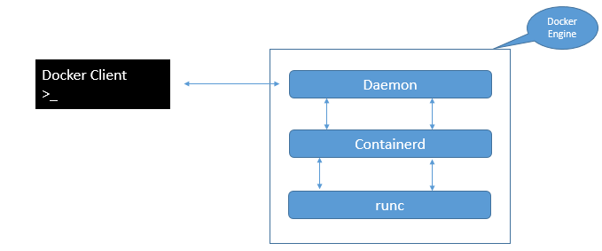
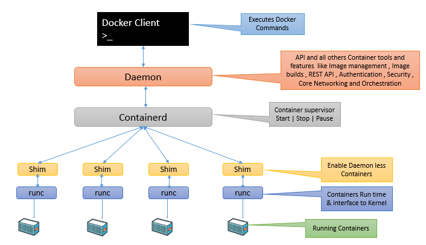

# Docker Engine

Docker Engine là phần mềm cốt lõi (core software) của Docker, chịu trách nhiệm tạo, chạy và quản lý container.

Docker Engine được thiết kế theo kiến trúc module (modular architecture), chia hệ thống thành nhiều thành phần nhỏ gồm nhiều thành phần chuyên biệt, mỗi thành phần đảm nhiệm một chức năng riêng. Các thành phần này phối hợp với nhau theo các tiêu chuẩn của OCI để tạo ra môi trường container hiệu quả, linh hoạt và dễ mở rộng.

### 1. Thành phần chính của Docker Engine:

**Docker CLI**: giao diện dòng lệnh tương tác với Docker.
    

**Docker Daemon:** 

- Là tiến trình chính quản lý các đối tượng Docker như images, containers, networks, volumes, và thực hiện các thao tác xây dựng, chạy, phân phối container.

- Linux: `/usr/bin/dockerd`.

**Docker API** là một API RESTful cho phép tương tác với Docker daemon (dockerd). Thông qua Docker API có thể quản lý các đối tượng Docker như images, containers, networks, và volumes bằng cách gửi các yêu cầu HTTP từ các công cụ như curl, hoặc thông qua các SDK chính thức của Docker (Go, Python).

**Containerd:** 

- Là một container runtime cấp cao (high-level container runtime), nằm giữa dockerd và runtime cấp thấp như runc. 

- Docker Engine sử dụng containerd để thực hiện các thao tác như tạo, khởi động và dừng container.

- Linux: `/usr/bin/containerd`.

<!-- dockerd quyết định Docker cần làm gì, còn containerd chịu trách nhiệm quản lý vòng đời container và điều phối việc chạy container. -->

**BuildKit** là backend xây dựng (builder backend) được Docker sử dụng để thực thi các tác vụ build image.

**Plugin System** cho phép mở rộng chức năng của Docker Engine bằng cách cài đặt, khởi động, dừng và gỡ bỏ các plugin (process nằm ngoài daemon).

**Containerd-shim:**

- `containerd-shim` là một process trung gian nằm giữa `containerd` và container runtime, cho phép sử dụng các runtime thay thế mà không cần thay đổi cấu hình của `Docker daemon`.

- Khi chạy `container` với một runtime cụ thể, `containerd` sẽ gọi `containerd-shim` tương ứng để thực thi `container` đó.

- Khi `containerd` gọi `runc` để tạo `container`, `runc` chỉ thực tạo container rồi thoát, `containerd-shim` trở thành tiến trình cha của container và tồn tại trong suốt vòng đời của nó. `ahim` có nhiệm vụ duy trì các luồng STDIN/STDOUT/STDERR, theo dõi trạng thái của `container` và báo cáo mã thoát (exit status) cho `containerd`. Nhờ có `shim`, `container` có thể tiếp tục chạy ngay cả khi `containerd` hoặc `dockerd` được khởi động lại, giúp tách vòng đời của `container` khỏi `daemon Docker`.

**runc:** 

- `runc` là container runtime mặc định được sử dụng bởi `containerd` trong Docker Engine. 

- `runc` chịu trách nhiệm thực thi và quản lý các container ở cấp độ thấp nhất, cụ thể là tạo và chạy các process container dựa trên tiêu chuẩn Open Container Initiative (OCI). Khi Docker Engine quản lý vòng đời container thông qua containerd, containerd sẽ sử dụng runc để thực sự khởi tạo và vận hành container.

- Linux: `/usr/bin/runc`.

<!-- runc là thành phần thực thi container thực tế, containerd là lớp quản lý vòng đời container, và Docker Engine sử dụng cả hai để cung cấp trải nghiệm quản lý container hoàn chỉnh. -->
    
**Linux Kernel Features** Docker tận dụng các tính năng của nhân Linux như namespaces, cgroups,OverlayFS để cô lập và quản lý tài nguyên cho container.

**Container Process:** Là process thực tế chạy bên trong `container`.

---

### 2. Connecting and Managing Docker Engine
