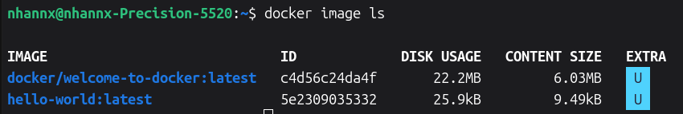
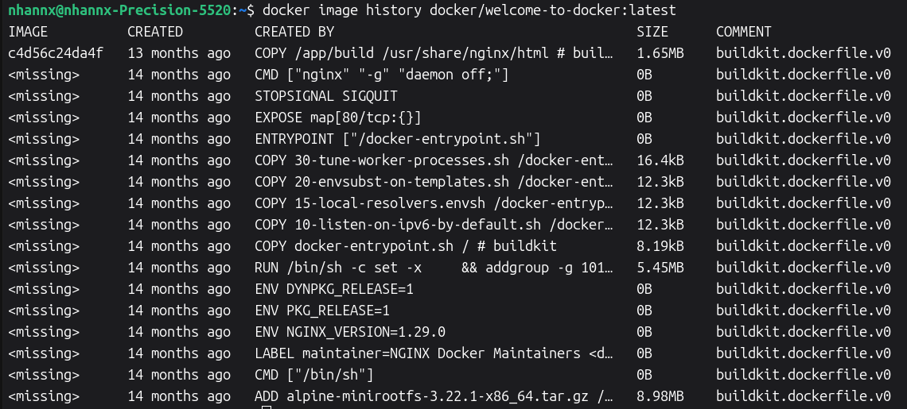
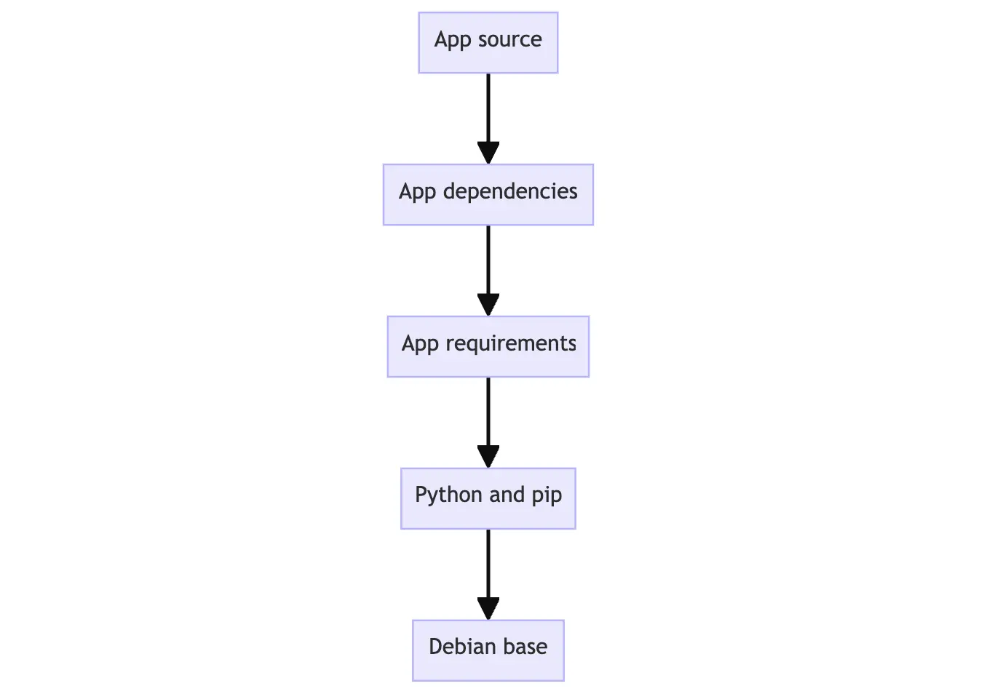
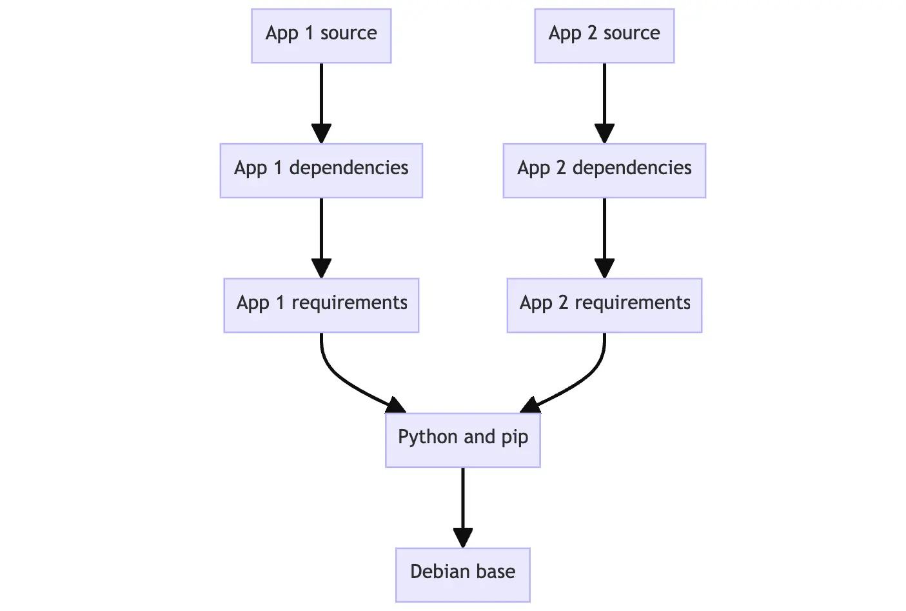

### Docker Images

### 1. What is an Image

A container image is a standardized package that includes all of the files, binaries, libraries, and configurations to run a container.

**Principles of images:**

- Immutable: Once an image is created, it cannot be modified; but it is available to make new image or add changes on top of it.

- Container images are composed of layers: Each layer represent a set of file system changes (add, remove, modifiy files)

Docker Hub is the default global marketplace for storing and distributing images. You can search for Docker Hub images and run them directly from Docker Desktop.

**Seach for images:**

```docker 
docker search docker/welcome-to-docker
```

**List downloaded images:**

```docker 
docker image ls
```


**List the image's layers:**

```docker
docker image history docker/welcome-to-docker
```


### 2. Image Layers

Container Images are composed of layers. Each layer in an image contains a set of filesystem changes.



This allows layers to be reused btw images. Layers let images to be extended by reusing base layers, allow adding the data that the application needed.




<!-- Tham khao -->
**Docker images** consist of layers, which is the result of a build instruction in the `Dockerfile`. Layers are stacked sequentially, and each one is a ***delta*** (the changes) applied to the previous layer.

Consider the following `Dockerfile`:

```docker
FROM ubuntu:24.04

RUN apt-get update
RUN apt-get install -y nginx
COPY app.py /app/app.py
```

The images being built would look like this:

        ┌──────────────────────────────┐
        │ Layer 3                      │
        │ + /app/app.py                │
        ├──────────────────────────────┤
        │ Layer 2                      │
        │ + nginx + dependencies       │
        ├──────────────────────────────┤
        │ Layer 1                      │
        │ + apt package metadata       │
        ├──────────────────────────────┤
        │ Base Layer                   |
        | ubuntu:24.04                 │
        └──────────────────────────────┘


<!-- 
Docker images use a layered, copy-on-write (CoW) strategy. Each instruction in a Dockerfile creates a new image layer, and only the changes (the "delta") from the previous layer are stored. This approach has several benefits:

Shared layers: If multiple images share the same base layers, those layers are stored only once on disk and reused, saving storage space.
Efficient builds and pulls: When you build or pull images, only the new or changed layers need to be transferred, reducing network bandwidth and speeding up operations.
Versioning and caching: Each layer is immutable and can be cached, making builds faster and more reliable.
For example, if you build two images where the second uses the first as a base and adds more steps, Docker only stores the new layers for the second image. Shared layers are not duplicated.

This design makes Docker images smaller, faster to distribute, and more efficient to manage. 
-->

Layer Storage

- Each layer is stored separately in its own directory on the host filesystem (typically /var/lib/docker/ on Linux)
- Layers are immutable — once created, they cannot be changed
- Each layer is identified by a content-addressable hash (SHA256), so layers are tracked by their content, not just a name

How Layers Are Referenced & Stacked

- Downloaded separately: When you pull an image, each layer downloads independently
- Stored once: If multiple images share the same layer, it's stored only once on disk and referenced by both images. This reduces storage and bandwidth significantly
- Union filesystem: When you run a container, Docker uses a union filesystem to stack all the read-only image layers on top of each other, creating a single unified view of the filesystem
- Container layer on top: Containers add a writable layer on top of the read-only image layers, allowing changes without modifying the original image

Copy-on-Write (CoW)

- When a container modifies a file from an underlying layer, Docker copies that file into the writable container layer first, then writes to the copy
- The original file in the read-only layer remains untouched
- This allows multiple containers to share the same image layers while having independent data


### Union File System