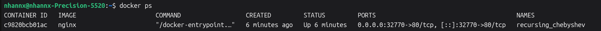
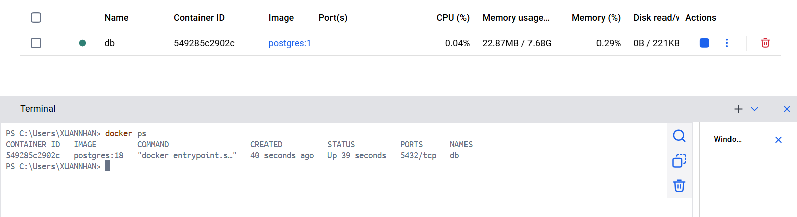
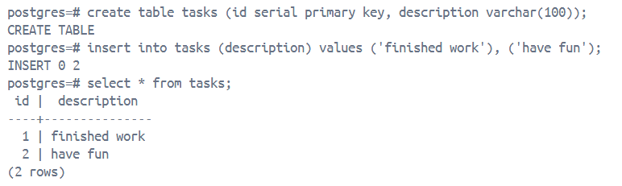
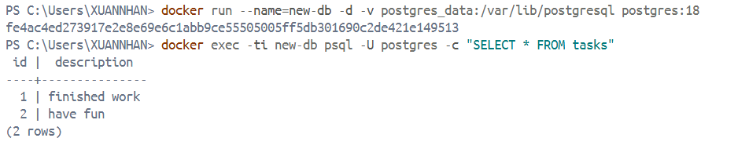
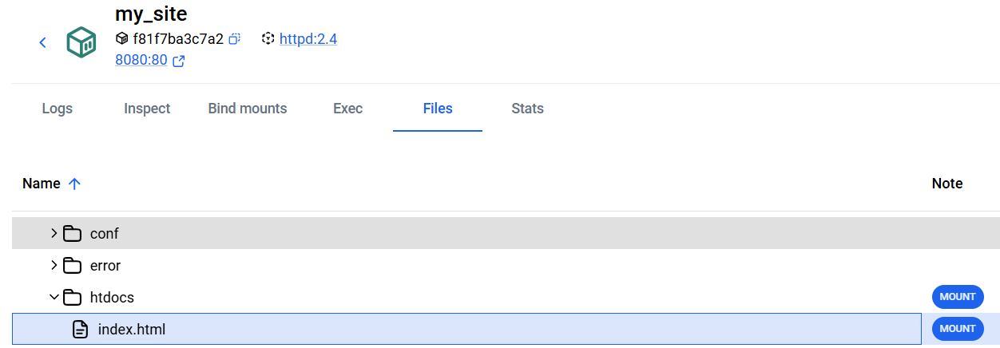
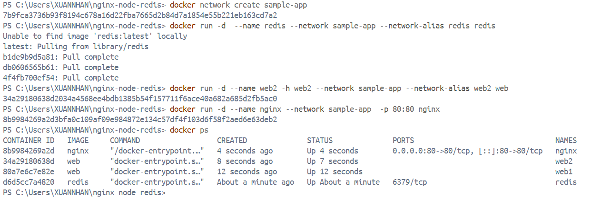
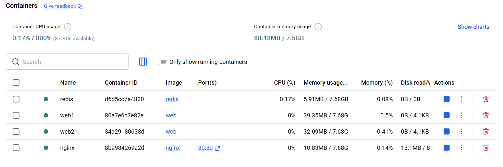

# Docker Containers

[What is a Container](#1-what-is-a-container)  
[Publishing and Exporting Ports](#2-publishing-and-exposing-ports)  
[Overiding Container Defaults](#3-overriding-container-defaults)  
[Persisting Container Data](#4-persisting-container-data)  
[Share Local Files with Containers](#5-share-local-files-with-containers)  
[Multi-container Application](#6-multi-container-application)

---

### 1. What is a Container?

A Docker container is a runnable instance of a Docker image. 

It is an isolated process that runs on your host system, with its own filesystem, networking, and process tree, separate from the host and other containers.

Key characteristics:

- **Self-contained**: Each container has all the files and dependencies it needs to run.

- **Isolated**: Containers run in isolation from each other and from the host, increasing security and reducing conflicts.

- **Independent**: Each container can be started, stopped, moved, or deleted independently.

- **Portable**: Containers can run anywhere—on a developer's laptop, in a data center, or in the cloud—ensuring consistency across environments.

Containers and VMs are both technologies for isolating workloads: 

- VMs run a full operating system, creating significant overhead.

- A container is an isolated process; multiple containers share the same kernel, allowing more apps on less infrastructure.

### 2 Publishing and Exposing Ports

Containers provides isolated processes for each components of an App which is great for security and managing dependencies, but also means cannot access the App directly.

The port publishing breaks network isolation by setting up a forwarding rule. 

```bash
docker run -d -p HOST_PORT:CONTAINER_PORT

# -p stands for --publish
```

Any traffic sent to `HOST_PORT` on host machine will be forwarded to `CONTAINER_PORT` within the container.

To publish the container's port 80 to host's port 8080:

```
docker run -d -p 8080:80 docker/welcome-to-docker
```

**Publishing on a specific host IP**

By default, published ports listen on all host interfaces (0.0.0.0 / ::). 

To bind to a single address, putting the IP first in the publish string:

```bash
docker run -d -p HOST_IP:HOST_PORT:CONTAINER_PORT
```

Use `127.0.0.1` to keep the port local to the machine

In compose:

```bash
# compose.yaml
services:
  app:
    image: docker/welcome-to-docker
    ports:
      - "127.0.0.1:8080:80"
```

**Publishing to ephemeral ports**

Omitting the HOST_PORT, Docker will automatically pick the port

```docker run -p 80 nginx```



**Publishing all ports**

When creating a container image, the `EXPOSE` instruction is used to indicate the packaged application will use the specified port. These ports aren't published by default.

With the `-P` or `--publish-all`, Docker automatically publishes all exposed ports to ephemeral ports, usefully when trying to avoid conflicts.

### 3. Overriding Container Defaults

**Overiding the network ports**

The `-p` option in `docker run` maps host ports to container ports, allows running multiple instances of the container without any conflict. 

**Setting environment variables**

Using the flag `-e` to set an environment variable into the container

```docker
docker run -e foo=bar postgres env
```

This option sets an environment variable foo inside the container with the value bar.

Using the flag `--env-file` to set environment variables with the `.env` file.

```docker
docker run --env-file .env postgres env
```

**Resource limits**

By default, containers is not limited in resource consuming.

Using the `--memory` and `--cpus` flags to restrict how much CPU and memory a container can use.

```docker
docker run -e POSTGRES_PASSWORD=secret --memory="512m" --cpus="0.5" postgres
```

The `docker stats` command helps with monitoring real-time resource usage.

**Custom Network**

Containers use `bridge` network as default when running, allowing communication btw containers (only buy IP) while keeping them isolated from host/outside world (unrelated containers are able to communicate).

The `--network <network_name>` flags attach a custom network to a container, enhance isolation and help with DNS resolution.

1. Create a new custom network

```docker
docker network create mynetwork
```

2. Lits all networks

```docker
docker network ls
```

3. Connect containers to the custom network

```docker
docker run -d -e POSTGRES_PASSWORD=secret -p 5434:5432 --network mynetwork postgres
```

**Override the default CMD and ENTRYPOINT**

Sometimes, it is needed to override the default commands (CMD) or entry points (ENTRYPOINT) defined in a Docker image, especially when using Docker Compose.

*Docker CLI:* attach at the end of `docker run` command

```docker
docker run -e POSTGRES_PASSWORD=secret postgres docker-entrypoint.sh -h localhost -p 5432
```

*Docker compose:* set `entrypoint` and `command` inside `compose.yml` file

```docker
services:
  postgres:
    image: postgres:18
    entrypoint: ["docker-entrypoint.sh", "postgres"]
    command: ["-h", "localhost", "-p", "5432"]
    environment:
      POSTGRES_PASSWORD: secret 
```

### 4. Persisting Container Data

Docker container is ephemeral: When the container starts, it uses files and configs provided by the image. When the container is deleted, the files inside are also deleted.

To solve this issue, Docker provides the ability to **persisting container data** using **volumes**.

**Volumes** are a storage mechanism providing the ability to persist data beyond container lifecycle. Volumes work the same as a shortcut from the inside container to the outside container.

Attaching the same volume to multiple containers to share files btw containers.

*Create a volume:* (the `-v` flag stands for volume)

```docker
docker volume create log-data
```

*Attach a volume to a container:*

```docker
docker run -d -p 80:80 -v log-data:/logs docker/welcome-to-docker
```

*List all volumes:*

```docker
docker volume ls
```

*Remove a volume (when it is not attached to any containers):*

```docker
docker volume rm <volume-name-or-id>
```

*Remove all unused (unattached) volumes:*

```docker
docker volume prune
```

**Lab**

1. Start a container using the Postgres image

```docker 
docker run --name=db -e POSTGRES_PASSWORD=secret -d -v postgres_data:/var/lib/postgresql postgres:18
```



2. In the PostgreSQL command line, create a database table and insert two records

```sql 
CREATE TABLE tasks (
    id SERIAL PRIMARY KEY,
    description VARCHAR(100)
);
INSERT INTO tasks (description) VALUES ('Finish work'), ('Have fun');
```



3. Stop and remove the database container

```docker 
docker stop db
docker rm db
```

4. Start a new container, attach the same volume with the persisted data

```docker
docker run --name=new-db -d -v postgres_data:/var/lib/postgresql postgres:18
```

5. Verify the database still has the records

```docker
docker exec -ti new-db psql -U postgres -c "SELECT * FROM tasks"
```



### 5. Share Local Files with Containers

The isolation characteristic of containers means containers can't directly access data on the host machine by default.

Docker offers **Bind mount**, allow real-time file access and sharing between the host and container (ideal for development environment).

Start a container using a bind mount by `-v` flag and map it to the container file location .

```docker
docker run -v /HOST/PATH:/CONTAINER/PATH -it nginx
```

The `--mount` flag offers more advanced features and control. 

By default, using `--mount` in case of a file or directory that doesn't yet exist doesn't automatically create it but generates an error.

```docker
docker run --mount type=bind,source=/HOST/PATH,target=/CONTAINER/PATH,readonly nginx
```

**File permission**

To grant read/write access, using the `:ro` flag (read-only) or `:rw` (read-write) with the `-v` or `--mount` flag.

```docker
docker run -v HOST-DIRECTORY:/CONTAINER-DIRECTORY:rw nginx
```

<!-- Synchronized File Share -->

**Lab**

1. Start a container using the `httpd` image

```docker 
docker run -d -p 8080:80 --name my_site httpd:2.4
```

Open the browser and access `http://localhost:8080`

After that, delete the existing container.

2. Create a new directory called `public_html` on host system and create a file called `index.html` with the following content:

```html 
<!DOCTYPE html>
<html lang="en">
<head>
<meta charset="UTF-8">
<title> My Website with a Whale & Docker!</title>
</head>
<body>
<h1>Whalecome!!</h1>
<p>Look! There's a friendly whale greeting you!</p>
<pre id="docker-art">
   ##         .
  ## ## ##        ==
 ## ## ## ## ##    ===
 /"""""""""""""""""\___/ ===
{                       /  ===-
\______ O           __/
\    \         __/
 \____\_______/

Hello from Docker!
</pre>
</body>
</html>
```

3. Run the container

```docker 
docker run -d --name my_site -p 8080:80 --mount type=bind,source=./,target=/usr/local/apache2/htdocs/ httpd:2.4
```

4. Access the file on dashboard

Directory `/usr/local/apache2/htdocs/`




### 6. Multi-container Application

As applications grow in size, managing them as individual containers becomes more difficult.

- Running ``docker run`` commands (frontend, backend, and database) with different configurations may cause error-prone and time-consuming. 

- Applications often rely on each other. Manually starting containers in an order or managing network connections become difficult as the stack expands.

- Each application needs its docker run command, making it difficult to scale individual services.

- Persisting data for each application requires separate volume mounts or configurations, creating a scattered data management approach.

- Setting environment variables for each application through separate docker run commands is tedious and error-prone.

That's where `Docker Compose` comes to the rescue.

Docker Compose defines multi-container application in a single `YAML` file called `compose.yml`. This file specifies configurations for all containers, their dependencies, environment variables, and even volumes and networks.

**Lab**

1. Get the sample application. 

    ```bash
    git clone https://github.com/dockersamples/nginx-node-redis
    ```

2. Build the Images

    Navigate into the `nginx` directory to build the image

    ```bash 
    docker build -t nginx .
    ```

    Navigate into the `web` directory and build the first web image

    ```bash 
    docker build -t web .
    ```

3. Run the containers

    Create a network to communicate through

    ```bash
    docker network create sample-app
    ```

    Start the Redis container, attach to the previously created network and create a network alias

    ```bash
    docker run -d  --name redis --network sample-app --network-alias redis redis
    ```

    Start the first web container

    ```bash
    docker run -d --name web1 -h web1 --network sample-app --network-alias web1 web
    ```

    Start the second web container

    ```bash
    docker run -d --name web2 -h web2 --network sample-app --network-alias web2 web
    ```

    Start the Nginx container

    ```bash
    docker run -d --name nginx --network sample-app  -p 80:80 nginx
    ```

    Verify the containers

    
    