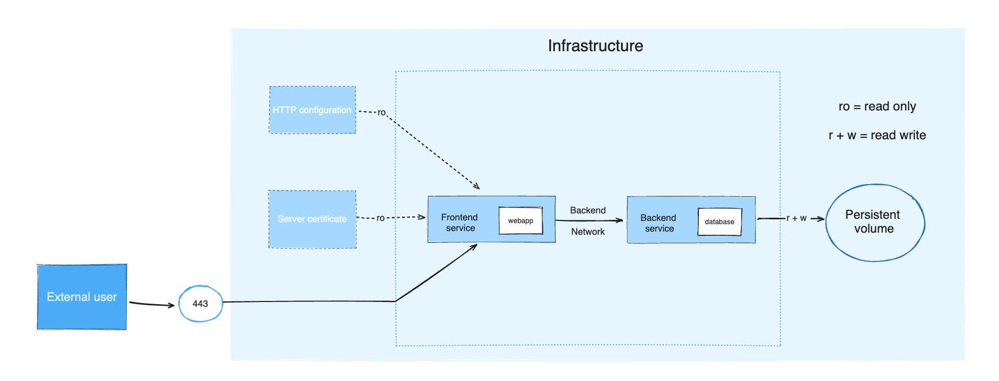
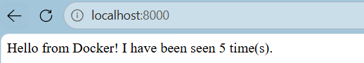
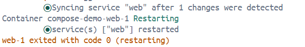
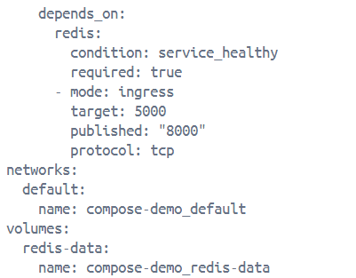
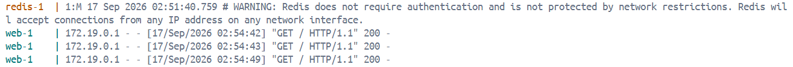
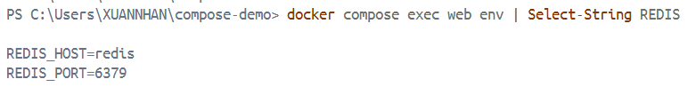
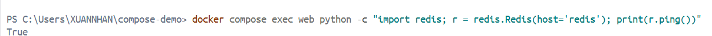

# Docker Compose

[What is Docker Compose](#1-what-is-docker-compose)  
[How Compose Works](#2-how-compose-works)  
[Compose Lab](#3-docker-compose-lab)

### 1. What is Docker Compose

Docker Compose is a tool for defining and running multi-container applications.

Compose simplifies the control of application stack, making it easy to manage services, networks, and volumes in a single YAML configuration file.

**Key benefits of Docker Compose**

- Simplified control: Define and manage multi-container apps in one YAML file 
    <!-- streamlining orchestration and replication. -->

- Efficient collaboration: Shareable YAML files support collaboration between developers and operations, improving workflows and issue resolution, leading to increased overall efficiency.

- Rapid application development: Compose caches the configuration used to create a container. When restarting a service that has not changed, Compose reuses the existing containers, which means quick changes in environment. 

- Portability across environments: Compose supports variables in the Compose file, helps customizing composition for different environments, or different users.

**Common Use Case**

- Development Environments:

    The Compose file provides a way to document and configure all of the application's service dependencies (databases, queues, caches, web service APIs, etc).  

    Using the Compose command line tool you can create and start one or more containers for each dependency with a single command.

- Automated testing environments:
    
    An important part of CI/CDs process is the automated test suite. Compose provides a convenient way to create and destroy isolated testing environments for your test suite.

    ```bash
    docker compose up -d
    ./run_tests
    docker compose down
    ```

- Single host deployments:
    
    Compose supports production deployments on single hosts, deploying applications to remote Docker hosts and manage production-specific configurations.

### 2. How Compose Works?

With Docker Compose a YAML configuration file, known as the Compose file, is used to configure application’s services. All the services from configuration can be created and start with the Compose CLI.

**The Compose file**

The default path for a Compose file is `compose.yaml` (preferred) or `compose.yml`, placed in the working directory. 

Compose also supports `docker-compose.yaml` and `docker-compose.yml` for backwards compatibility of earlier versions. If both files exist, Compose prefers the canonical `compose.yaml`.

**CLI**

The Docker CLI lets users interact with Docker Compose applications through the `docker compose` command.

The CLI commands enable managing the lifecycle of multi-container applications (start, stop, and configure).

To start all the services defined in your compose.yaml file:

```bash 
docker compose up
```

To stop and remove the running services:

```bash
docker compose down
```

To view the logs:

```bash
docker compose logs
```

To list all services and their current status:

```bash 
docker compose ps
```

**Example**



The example application is composed of the following parts:

- Two services, backed by Docker images: webapp and database
- One secret (HTTPS certificate), injected into the frontend
- One configuration (HTTP), injected into the frontend
- One persistent volume, attached to the backend
- Two networks

```yaml
services:
  frontend:
    image: example/webapp
    ports:
      - "443:8043"
    networks:
      - front-tier
      - back-tier
    configs:
      - httpd-config
    secrets:
      - server-certificate

  backend:
    image: example/database
    volumes:
      - db-data:/etc/data
    networks:
      - back-tier

volumes:
  db-data:
    driver: flocker
    driver_opts:
      size: "10GiB"

configs:
  httpd-config:
    external: true

secrets:
  server-certificate:
    external: true

networks:
  # The presence of these objects is sufficient to define them
  front-tier: {}
  back-tier: {}
```

### 3. Docker Compose Lab

#### 3.1 Set up the Project

1. Create a dir for the project

    ```bash
    mkdir compose-demo
    cd compose-demo
    ```

2. Create `app.py` and add the following:

    ```python
    import os
    import redis
    from flask import Flask

    app = Flask(__name__)
    cache = redis.Redis(
        host=os.getenv("REDIS_HOST", "redis"),
        port=int(os.getenv("REDIS_PORT", "6379")),
    )

    @app.route("/")
    def hello():
        count = cache.incr("hits")
        return f"Hello from Docker! I have been seen {count} time(s).\n"
    ```

3. Create `requirements.txt` and add the following:

    ```text
    flask
    redis
    ```

4. Create a docker file

    ```docker file
    # syntax=docker/dockerfile:1

    # Build an image with the Python 3.12 image
    FROM python:3.12-alpine

    # Set the working directory to `/code`
    WORKDIR /code

    # Set environment variables used by the `flask` command
    ENV FLASK_APP=app.py
    ENV FLASK_RUN_HOST=0.0.0.0

    # Install `gcc` and other dependencies
    RUN apk add --no-cache gcc musl-dev linux-headers

    # Copy `requirements.txt`
    COPY requirements.txt .

    # Install the Python dependencies
    RUN pip install -r requirements.txt

    # Copy the current directory `.` in the project to the workdir `.` in the image
    COPY . .

    EXPOSE 5000

    # Set the default command for the container to `flask run --debug`
    CMD ["flask", "run", "--debug"]
    ```

5. Create a `.env` file to hold configuration values

    ```env
    APP_PORT=8000
    REDIS_HOST=redis
    REDIS_PORT=6379
    ```

6. Create a `.dockerignore` file to keep unnecessary files out of your build context

    ```
    .env
    *.pyc
    __pycache__
    redis-data
    ```

#### 3.2. Define and Start Services

1. Create `compose.yaml`

    ```yaml
    services:
    web:
        build: .
        ports:
        - "${APP_PORT}:5000"
        environment:
        - REDIS_HOST=${REDIS_HOST}
        - REDIS_PORT=${REDIS_PORT}

    redis:
        image: redis:alpine
    ```

    This Compose file defines two services:

    - The `web` service uses an image that's built from the Dock`erfile.

    - The `redis` service uses a public Redis image pulled from the Docker Hub registry.

2. Start Application

    ```bash
    docker compose up
    ```

3. Open `http://localhost:8000`

    

4. Stop the stack before moving on

    ```bash
    docker compose down
    ```

#### 3.3. Fix the [Startup Race](../note/xxx/startup-race.md) with Health Checks

To fix the [startup race](../note/xxx/startup-race.md), Compose needs to wait until `redis` is confirmed healthy before starting `web`.

1. Update `compose.yaml`

    ```yaml
    services:
    web:
        build: .
        ports:
        - "${APP_PORT}:5000"
        environment:
        - REDIS_HOST=${REDIS_HOST}
        - REDIS_PORT=${REDIS_PORT}
        depends_on:
        redis:
            condition: service_healthy

    redis:
        image: redis:alpine
        healthcheck:
        test: ["CMD", "redis-cli", "ping"]
        interval: 5s
        timeout: 3s
        retries: 5
        start_period: 10s
    ```

    The `healthcheck` block tells Compose how to test whether Redis is ready:

    - `test` is the command Compose runs inside the container to check its health. `redis-cli ping` connects to Redis and expects a `PONG` response — if it gets one, the container is healthy.

    - `start_period` gives Redis 10 seconds to initialize before health checks begin. Any failures during this window don't count toward the retry limit.

    - `interval` runs the check every 5 seconds after the start period has elapsed.

    - `timeout` gives each check 3 seconds to respond before treating it as a failure.

    - `retries` sets how many consecutive failures are allowed before Compose marks the container as unhealthy. With `interval: 5s` and `retries: 5`, Compose will wait up to 25 seconds before giving up.

2. Start the stack to confirm the ordering is fixed:

    ```bash
    docker compose up
    ```

    The console should has something similar to:

    

3. Open `http://localhost:8000`, then stop the stack

    ```bash
    docker compose down
    ```

#### 3.4. Enable Compose Watch for live updates

Without Compose Watch, every code change requires the stack to be stopped, rebuild the image, and restart the containers. Compose Watch eliminates that cycle by automatically syncing changes into running container as saving files.

1. Update `compose.yaml` to add the `develop.watch` block to the `web` service:

    ```yaml
    services:
      web:
        build: .
        ports:
          - "${APP_PORT}:5000"
        environment:
          - REDIS_HOST=${REDIS_HOST}
          - REDIS_PORT=${REDIS_PORT}
        depends_on:
         redis:
            condition: service_healthy
        develop:
          watch:
            - action: sync+restart
              path: .
              target: /code
            - action: rebuild
              path: requirements.txt

      redis:
        image: redis:alpine
        healthcheck:
          test: ["CMD", "redis-cli", "ping"]
          interval: 5s
          timeout: 3s
          retries: 5
          start_period: 10s
    ```

    The `watch` block defines two rules:

    - The `sync+restart` action watches project directory (`.`) on the host. When a file changes, Compose copies any changed files into `/code` inside the running container, then restarts the container. Because the container restarts with the updated files already in place, Flask starts up reading the new code directly — no manual rebuild or restart needed.

    - The `rebuild` action on `requirements.txt` triggers a full image rebuild whenever adding a new dependency, since installing packages requires rebuilding the image, not just syncing files.

2. Start the stack in Watch enabled:

    ```bash
    docker compose up --watch
    ```

3. Make a live change. Open `app.py` and update the greeting:

    ```python
    return f"Hello from Compose Watch! I have been seen {count} time(s).\n"
    ```

4. Save the file. Compose Watch detects the changes and syncs imediately:

    

5. Refresh `http://localhost:8000`:

    

6. Stop the stack

#### 3.5. Persist data with named volumes

Each time stopping and restarting the stack the visit counter resets to 0. Redis data lives inside the container, so it disappears when the container is removed. A named volume fixes this by storing the data on the host, outside the container lifecycle.

1. Update compose.yaml:

    ```yaml
    services:
      web:
        build: .
        ports:
          - "${APP_PORT}:5000"
        environment:
          - REDIS_HOST=${REDIS_HOST}
          - REDIS_PORT=${REDIS_PORT}
        depends_on:
          redis:
            condition: service_healthy
        develop:
          watch:
            - action: sync+restart
              path: .
              target: /code
            - action: rebuild
              path: requirements.txt

      redis:
        image: redis:alpine
        volumes:
        	- redis-data:/data
        healthcheck:
					test: ["CMD", "redis-cli", "ping"]
					interval: 5s
					timeout: 3s
					retries: 5
					start_period: 10s

		volumes:
			redis-data:
    ```

    The `redis-data:/data` entry under `redis.volumes` mounts the named volume at `/data`, the path where Redis writes its data files. The top-level `volumes` key registers it with Docker so it persists between `compose down` and `compose up` cycles.

2. Start the stack with `docker compose up --watch` and refresh `http://localhost:8000` a few times to build up a count.

3. Tear down the stack with `docker compose down` and then bring it back up again with `docker compose up --watch`.

4. Open `http://localhost:8000` - the counter continues from where it left off.

5. Now reset the counter with `docker compose down -v`.

	The `-v` flag removes named volumes along with the containers. Use this intentionally — it permanently deletes the stored data.   

#### 3.6. Structure project with multiple Compose files

As applications grow, a single `compose.yaml` becomes harder to maintain. The `include` top-level element lets split services across multiple files while keeping them part of the same application. This is useful when different teams own different parts of the stack, or when reusing infrastructure definitions across projects.

1. Create a new file in project directory called `infra.yaml` and move the Redis service and volume into it:

	```yaml 
	services:
		redis:
			image: redis:alpine
			volumes:
				- redis-data:/data
			healthcheck:
				test: ["CMD", "redis-cli", "ping"]
				interval: 5s
				timeout: 3s
				retries: 5
				start_period: 10s
					
	volumes:
		redis-data:
	```

2. Update `compose.yaml` to include `infra.yaml`:

	```yaml
	include:
		- path: ./infra.yaml

	services:
		web:
	```

3. Run the application 

	Compose merges both files at startup. The `web` service can still reference `redis` by name because all included services share the same default network.

4. Stop the stack

#### 3.7. Inspect and debug running stack

A fully configured stack helps with observing what's happening inside containers without stopping anything. This step covers the core commands for inspecting the resolved configuration, streaming logs, and running commands inside a running container.  

Before starting the stack, verify that Compose has resolved `.env` variables and merged all files correctly:  

```bash
docker compose config
```  



- `${APP_PORT}`, `${REDIS_HOST}`, and `${REDIS_PORT}` have all been replaced with the values from your .env file.

- Short-form port notation (`"8000:5000"`) is expanded into its canonical fields (`target`, `published`, `protocol`).

- The default network and volume names are made explicit, prefixed with the project name `compose-demo`.

- The output is the fully resolved configuration, with any files brought in via `include` merged into a single view.

Start the stack in detached mode so the terminal stays free for the commands

```bash
docker compose up -d
```  

1. Stream logs from all services

	```bash
	docker compose logs -f
	```

	The `-f` flag follows the log stream in real time, interleaving output from both containers with color-coded service name prefixes.  
	
	Refresh `http://localhost:8000` a few times and watch the Flask request logs appear. 

	


	To follow logs for a single service, pass its name:

	```bash
	docker compose logs -f web
	```

	Press `Ctrl+C` to stop following logs. The containers keep running.

2. Run commands inside a running container

	`docker compose exec` runs a command inside an already-running container without starting a new one. This is the primary tool for live debugging.

	**Verify environment variables are set correctly**

	```bash
	# linux  
	docker compose exec web env | grep REDIS
	
	# window powershell
	docker compose exec web env | Select-String REDIS
	```

	  
	
	**Test that the web container can reach Redis using the service name as the hostname**

	```bash
	docker compose exec web python -c "import redis; r = redis.Redis(host='redis'); print(r.ping())"
	```

	  

	This uses the same `redis` library the app uses, so a `True` response confirms that service discovery, networking, and the Redis connection are all working end to end.  

	**Inspect the live value of the hit counter in Redis**  

	```bash
	docker compose exec redis redis-cli GET hits
	```

	