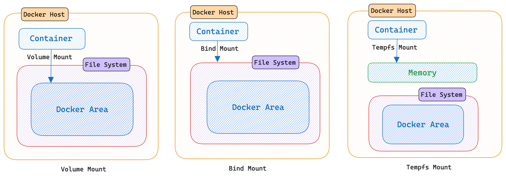
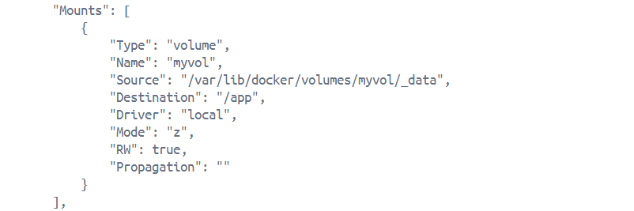
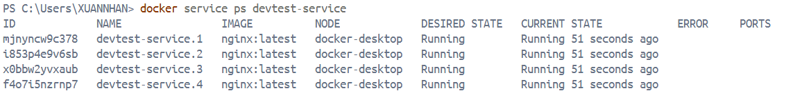
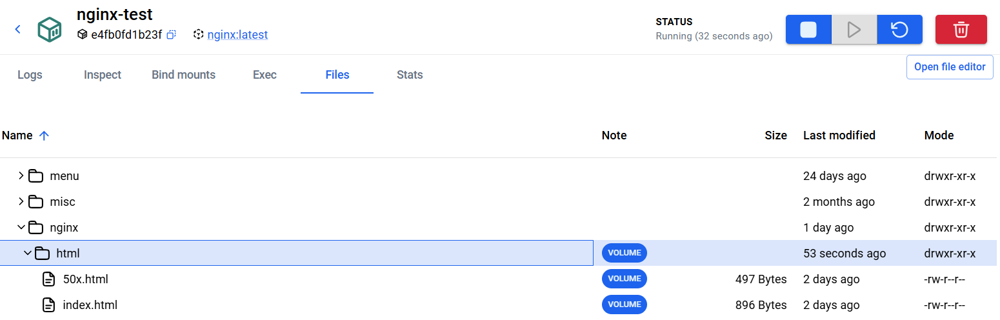
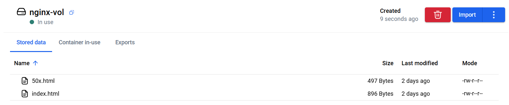
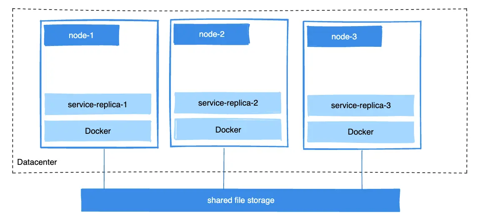
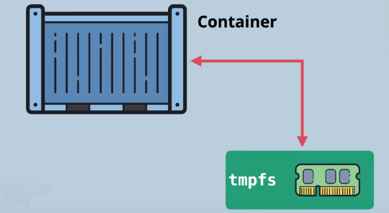
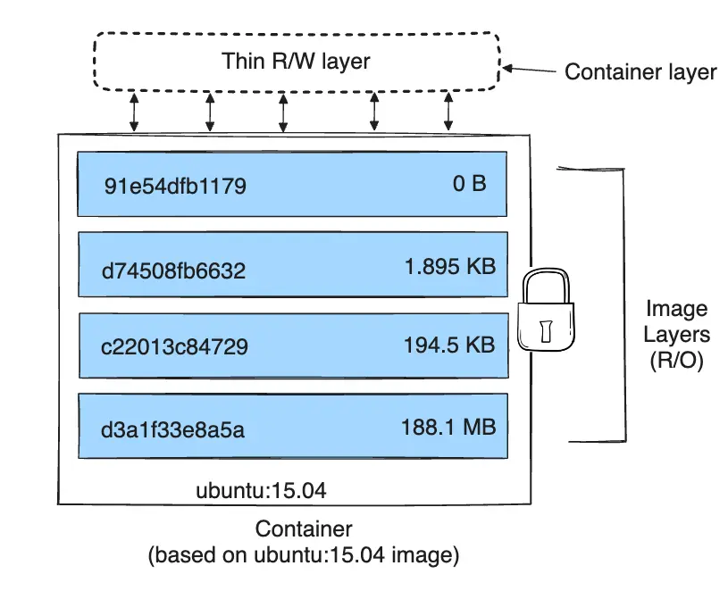
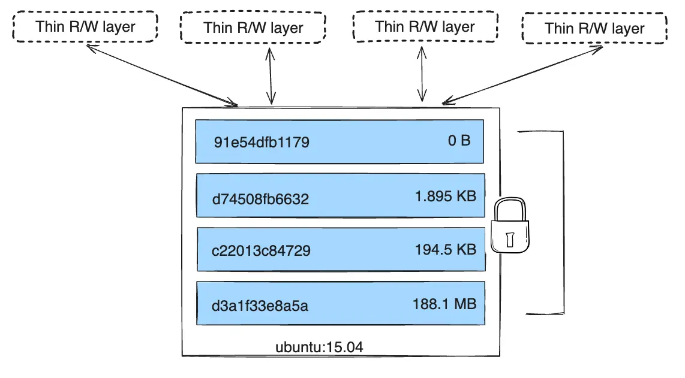
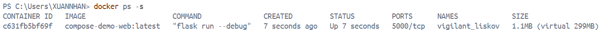

# Docker Storage

[Storage Concepts](#1-storage-concepts)  
[Volumes](#2-volumes)  
[Bind Mounts](#3-bind-mounts)  
[tmpfs Mounts](#4-tmpfs-mounts)  
[Image Mounts](#5-image-mounts)  
[Storage Drivers](#6-storage-drivers)  
[Containered Image Store](#7-containered-image-store)

---

### 1. Storage Concepts

**Docker storage** covers two different concepts:

- Container data persistence: How to store application data outside containers using [volumes](#2-volumes), [bind mounts](#3-bind-mounts), and [tmpfs mounts](#4-tmpfs-mounts). This data persists independently of container lifecycle.

  

- Daemon storage backends ([containerd image store](#7-containered-image-store) and [storage drivers](#6-storage-drivers)): How the daemon stores image layers and container writable layers on disk.

**Container layer basics**  

By default all files created inside a container are stored on a writable container layer that sits on top of the read-only, immutable image layers.

Data written to the container layer doesn't persist when the container is destroyed, which means difficult to get the data out of the container if another process needs it.

The writable layer is unique per container, can't easily extract the data to the host, or to another container.

---

### 2. Volumes

Volumes are persistent data stores for containers, created and managed by Docker. 

A volume can be created using the `docker volume create` command, or Docker can create a volume during container or service creation.

Docker volumes are stored in a directory on the Docker host machine, managed by the Docker daemon. Location:

- Linux: `/var/lib/docker/volumes/`
- Windows: `C:\ProgramData\docker\volumes\`

When the volume is mounted into a container, this directory is what's mounted into the container.

[When to use volumes](#21-when-to-use-volumes)  
[Volume's lifecycle](#22-volumes-lifecycle)  
[Mount a volume over existing data](#23-mount-a-volume-over-existing-data)  
[Named and anonymous volumes](#24-named-and-anonymous-volumes)  
[Syntax](#25-syntax)  
[Create and manage volumes](#26-create-and-manage-volumes)  
[Start a container with a volumes](#27-start-a-container-with-a-volumes)  
[Use a volume with Docker compose](#28-use-a-volume-with-docker-compose)    
[Use a read-only volume](#29-use-a-read-only-volume)  
[Mount a volume subdirectory](#210-mount-a-volume-subdirectory)  
[Share data between machines](#211-share-data-between-machines)   
[Use a volume driver](#212-use-a-volume-driver)  
[Backup, restore, or migrate data volumes](#213-backup-restore-or-migrate-data-volumes)  
[Remove volumes](#214-remove-volumes)  

#### 2.1. When to use volumes

Volumes are ideal for performance-critical data processing and long-term storage needs. 

**Use volumes when:**

- Persisting data (survive container removal or restarts (databases, logs, uploads)).

- Sharing data between containers (safely shared among multiple containers).

- High-performance I/O (r/w directly to the host filesystem).

- Backup/migration (easier than bind mounts).

- Cross-platform compatibility (work on both Linux and Windows containers).

**Don't use volumes if:**

- Access files from both the host and container — use [bind mounts](#3-bind-mounts) instead.

- Temporary runtime data that doesn't need to persist — use [tmpfs mount](#4-tmpfs-mounts) instead.

#### 2.2. Volume's lifecycle

A volume's contents exist outside the lifecycle of a given container.

1. **Creation:**

    A volume can be created explicitly using command  

    ```bash
    docker volume create <volume>
    ```    

    or automatically when runing  

    ```bash
    docker run -v <volume>:/data <image>
    ```

    During the first mount, a container can populate data inside image into volume.

2. **Mounting:**

    Multiple containers can mount to the same volume simultaneously.

    ```bash
    docker run --mount source=<volume>,target=/app/data <image>

    docker run -v <volume>:/app/data <image>
    ```

3. **Active use**

    Volume survives container removal and data persists across container restarts.

    Inspect volumes by command:

    ```bash
    docker volume ls 
    
    docker volume inspect <volume>
    ```

4. **Cleanup & Removal**

    When no running container is using a volume, the volume is still available to Docker (consume disk space). 

    Remove unused volumes:

    ```bash
    docker volume rm <volume>

    docker volume prune
    ```

#### 2.3. Mount a volume over existing data

Mounting a *non-empty volume* into a directory in the container in which files or directories exist, the pre-existing files (of container) are obscured by the mount. The volume's contents completely replace whatever was in the directory in the container's filesystem. The original files/directories at that mount point are not deleted - they're just hidden/inaccessible while the volume is mounted.

>  Volumes take precedence.  
>  No merging overhead. Mount operations are simple.  
>  Prevents conflicts.

Mounting an empty volume into a directory in the container in which files or directories exist, these files or directories are propagated (copied) into the volume by default. 

Similarity, start a container and specify a unexisted volume, an empty volume is created.

To prevent Docker from copying a container's pre-existing files into an empty volume, use the `volume-nocopy` option.

#### 2.4. Named and anonymous volumes
 
A volume may be named or anonymous.

Anonymous volumes are given a random name that's unique within a given Docker host. Anonymous volumes persist, except using the `--rm` flag when creating the container, in which case the anonymous volume associated with the container is destroyed.

#### 2.5. Syntax

To mount a volume with the `docker run` command, use either the `--mount` or `--volume` flag.

```bash
docker run --mount type=volume,src=<volume-name>,dst=<mount-path>

docker run --volume <volume-name>:<mount-path>
```

In general, `--mount` is preferred (more explicit and supports all the available options).

1. Options for `--mount`

    The `--mount` flag consists of multiple key-value pairs, separated by commas and each consisting of a `<key>=<value>` tuple. The order of the keys *isn't significant*.

    | Option | Description |
    |---|---|
    | `source`, `src` | The source of the mount. Omitted for anonymous volumes |
    | `destination`, `dst`, `target` | The path where the file or directory is mounted in the container. |
    | `volume-subpath` | A path to a [subdirectory](#210-mount-a-volume-subdirectory) within the volume to mount into the container. The subdirectory must exist before the volume is mounted to a container.  |
    | `readonly`, `ro` | Causes the volume to be [mounted into the container as read-only](#29-use-a-read-only-volume). |
    | `volume-nocopy` | Data at the destination [isn't copied into the volume if the volume is empty](#23-mount-a-volume-over-existing-data). |
    | `volume-opt` | Can be specified more than once, takes a key-value pair consisting of the option name and its value. |

    ```bash
    docker run --mount type=volume,src=myvolume,dst=/data,ro,volume-subpath=/foo
    ```

2. Options for `--volume`

    The `--volume` or `-v` flag consists of three fields, separated by colon characters (:), must be in the correct order.

    ```bash
    docker run -v [<volume-name>:]<mount-path>[:opts]
    ```

    - For anonymous volumes, the first field is omitted.
    - The second field is the path where the file or directory is mounted in the container.
    - The third field is optional, and is a comma-separated list of options:  
        | Option | Description |
        | ------ | ----------- |
        | `readonly`, `ro` |  Causes the volume to be [mounted into the container as read-only](#29-use-a-read-only-volume). |
        | `volume-nocopy` | Data at the destination [isn't copied into the volume if the volume is empty](#23-mount-a-volume-over-existing-data). |

    ```bash
    docker run -v myvolume:/data:ro
    ```

#### 2.6. Create and manage volumes

Volume can be created and managed outside the scope of any container.

**Create a volume:**

```bash
docker volume create <volume>
```

**List volumes:**

```bash
docker volume ls
```

**Inspect a volume:**

```bash
docker volume inspect <volume>
```

**Remove a volume:**

```bash
docker volume rm <volume>
```

#### 2.7. Start a container with a volumes

Starting a container will create the volume that doesnt existed.

```bash
docker run -d --name devtest \
--mount source=<volume>,target=/app \
nginx:latest
```


`docker inspect devtest`



The above image show that the mount is a volume, the source and destination, and that the mount is read-write.

Stop the container and remove the volume

```bash
docker container stop devtest

docker container rm devtest

docker volume rm myvol2
```

#### 2.8. Use a volume with Docker compose

The following example shows a single Docker Compose service with a volume:

```yaml
services:
  frontend:
    image: node:lts
    volumes:
      - myapp:/home/node/app
volumes:
  myapp:
```

It is able to create a volume outside of Compose using `docker compose create` and ref it inside `compose.yaml`:

```yaml
services:
  frontend:
    image: node:lts
    volumes:
      - myapp:/home/node/app
volumes:
  myapp:
    external: true
```

1. **Start a service with volumes**

    The following example starts an nginx service with 4 replicas, each of which uses a local volume called myvol.

    ```bash
    docker service create -d --replicas=4 --name devtest-service --mount source=myvol,target=/app nginx:latest
    ```

    Use `docker service ps devtest-service` to verify that the service is running:

    

    Remove the service to stop the running tasks:

    ```bash
    docker service rm devtest-service
    ```

2. **Populate a volume using a container**

    Start a container which creates a new volume, the container has files or directories, Docker then copies the directory's contents into the volume. The container then mounts and uses the volume, and other containers using the volume also have access to the pre-populated content.

    The following example starts an `nginx` container and populates the new volume `nginx-vol` with the contents of the container's `/usr/share/nginx/html` directory.

    ```bash
    docker run -d \
      --name=nginxtest \
      --mount source=nginx-vol,destination=/usr/share/nginx/html \
      nginx:latest
    ```

    

    


#### 2.9 Use a read-only volume

Multiple containers can mount the same volume. For some applications, it's nessesary to mount a single volume as read-write for some containers and as read-only for others.

```bash
docker run -d \
  --name=nginxtest \
  --mount source=nginx-vol,destination=/usr/share/nginx/html,readonly \
  nginx:latest
```

Use the docker inspect, the Mount section should have this

```bash
"RW": false
```

#### 2.10. Mount a volume subdirectory

When mounting a volume to a container, specify a subdirectory of the volume to use with the `volume-subpath` parameter.

The subdirectory that is specified must exist in the volume before mount it into a container.

Useful when sharing a specific portion of a volume with a container. 

The following example creates a logs volume and initiates the subdirectories app1 and app2:

```bash
docker volume create logs

docker run --rm \
  --mount src=logs,dst=/logs alpine mkdir -p /logs/app1 /logs/app2

docker run -d \
  --name=app1 \
  --mount src=logs,dst=/var/log/app1,volume-subpath=app1 \
  app1:latest

docker run -d \
  --name=app2 \
  --mount src=logs,dst=/var/log/app2,volume-subpath=app2 \
  app2:latest
```

With this setup, the containers write their logs to separate subdirectories of the `logs` volume. The containers can't access the other container's logs.

#### 2.11. Share data between machines

Building fault-tolerant applications may need to configure multiple replicas of the same service to have access to the same files.



A way to achive this is to create volumes with a driver that supports writing files to an external storage system.

[Volume drivers](#212-use-a-volume-driver) abstract the underlying storage system from the application logic, hence allow changing volume drivers (external storage) without changing the application logic.

#### 2.12. Use a volume driver

Volume drivers are plugins that handle how Docker stores and manages volume data. They act as an abstraction layer between containers and actual storage backends.

**Default volume driver**: `local`

The `local` driver stores volume data on the Docker host machine in `/var/lib/docker/volumes/` (Linux) or `C:\ProgramData\docker\volumes\` (Windows).

```bash
# Explicitly specify local driver
docker volume create --driver local my_volume
```

**Third-party volume drivers (plugins):** Volume drivers enable Docker to integrate with external storage systems.

- **NFS** — Network File System for remote storage
- **AWS EBS** — Amazon Elastic Block Storage
- **Google Cloud Storage**
- **Azure File Share**
- **Ceph** — Distributed storage

Installing a third-party driver:

```bash
# Example: Install NFS driver
docker plugin install --alias nfs cicol/docker-volume-nfs

# Create volume with NFS driver
docker volume create --driver nfs --opt share=192.168.1.100:/export/data nfs_volume

# Use in container
docker run --mount source=nfs_volume,target=/data ubuntu
```

**Use cases:**  
- local — Development, single-host deployments
- NFS/CIFS — Team development, shared environments
- Cloud storage — Kubernetes, multi-region deployments

#### 2.13. Backup, restore, or migrate data volumes

https://docs.docker.com/engine/storage/volumes#back-up-restore-or-migrate-data-volumes

#### 2.14. Remove volumes

A Docker data volume persists after deleting a container. There are two types of volumes to consider:

- Named volumes have a specific name
- Anonymous volumes have no specific name. Therefore, when the container is deleted, instruction is needed for the Docker Engine daemon to remove them.

1. Remove anonymous volumes

    To automatically remove anonymous volumes, use the `--rm` option.

    ```bash
    docker run --rm -v /foo -v awesome:/bar busybox top
    ```

    The command creates an anonymous volumes `/foo` and a named volume `awesome`. When the container is removed, the Docker Engine automatically remove  the `/foo` volume.
  
2. Remove all volumes

    To remove all unused volumes and free up space:

    ```bash
    docker volume prune
    ```

### 3. Bind Mounts

When using a bind mount, a file or directory on the host machine is mounted into a container.

It is a contrast when using a volume, which will create a new directory within Docker's storage directory on the host machine. Docker creates and maintains this storage location, but containers access it directly using standard filesystem operations.

[When to use bind mounts](#31-when-to-use-bind-mounts)  
[Bind mounts over existing data](#32-bind-mounts-over-existing-data)  
[Considerations and constraints](#33-considerations-and-constraints)  
[Syntax](#34-syntax)  
[Start a container with a bind mount](#35-start-a-container-with-a-bind-mount)  
[Use a read-only bind mounts](#36-use-a-read-only-bind-mounts)  
[Recursive mounts](#37-recursive-mounts)  
[Config bind propagation](#38-config-bind-propagation)  
[Use a bind mount with Docker Compose](#39-use-a-bind-mount-with-docker-compose)  

#### 3.1. When to use bind mounts

Use case:

- Sharing src code or build artifacts between a development environment on the Docker host and a container.

- Create or generate files in a container and persist the files onto the host's filesystem.

- Sharing configuration files from the host machine to containers.

#### 3.2. Bind mounts over existing data

Bind-mounting file/directory into a directory in the container in which files/directories exist, the pre-existing files are obscured by the mount.

With containers, there's no straightforward way of removing a mount to reveal the obscured files again. Your best option is to recreate the container without the mount.

#### 3.3. Considerations and constraints

Bind mounts have write access to files on the host by default (may cause security implications). Using the `readonly` or `ro` option to prevent the container from writing to the mount.

Bind mounts are created to the Docker daemon host, not the client. So on, using a remote Docker daemon results in not being able to create a bind mount to access files on the client machine.

Containers with bind mounts are strongly tied to the host (may fail if run on a different host without the same directory structure).

#### 3.4. Syntax
To create a bind mount, use either the `--mount` or `--volume` flag.

```bash
docker run --mount type=bind,src=<host-path>,dst=<container-path>

docker run --volume <host-path>:<container-path>
```

In general, `--mount` is preferred, more explicit and supports all the available options. By default, `--mount` does not automatically create a directory if the specified mount path does not exist on the host.

Using `--volume` to bind-mount an unexisted file or directory, Docker automatically creates the directory on the host.

Using the `bind-create-src` option to automatically create the source directory on the host if it doesn't exist:

```bash
docker run --mount type=bind,src=/home/user/mydir,dst=/mnt/foo,bind-create-src alpine
```

1. Options for --mount

    The `--mount` flag consists of multiple key-value pairs, separated by commas and each consisting of a `<key>=<value>` tuple. The order of the keys isn't significant.

    ```bash
    docker run --mount type=bind,src=<host-path>,dst=<container-path>[,<key>=<value>...]
    ```

    | Option | Description |
    | :----- | :---------- |
    | `source`, `src` | The location (absolute/relative) of the file or directory on the host |
    | `destination`, `dst`, `target` | The path (absolute) where the file or directory is mounted |
    | `readonly`, `ro` | Cause the bind mount to be [mounted into the container as read-only](#36-use-a-read-only-bind-mounts) |
    | `bind-propagation` | Change the [bind propagation](#38-config-bind-propagation) |
    | `bind-create-src` | Automatically creates the source directory on the host if it doesn't exist |

    ```bash
    docker run --mount type=bind,src=.,dst=/project,ro,bind-propagation=rshared
    ```

2. Options for --volume

    The `--volume` or `-v` flag consists of three fields, separated by colon characters (:), must be in the correct order.

    ```bash
    docker run -v <host-path>:<container-path>[:opts]
    ```

    Valid options for --volume with a bind mount include:

    | Option | Description |
    | :----- | :---------- |
    | `readonly`, `ro` | Cause the bind mount to be [mounted into the container as read-only](#36-use-a-read-only-bind-mounts) |
    | `rprivate` (default) | Sets [bind propagation](#38-config-bind-propagation) to `rprivate` for this mount |
    | `private` (default) | Sets [bind propagation](#38-config-bind-propagation) to `private` for this mount |
    | `rshared` (default) | Sets [bind propagation](#38-config-bind-propagation) to `rshared` for this mount |
    | `shared` (default) | Sets [bind propagation](#38-config-bind-propagation) to `shared` for this mount |
    | `rslave` (default) | Sets [bind propagation](#38-config-bind-propagation) to `rslave` for this mount |
    | `slave` (default) | Sets [bind propagation](#38-config-bind-propagation) to `slave` for this mount |
    <!-- | `z`, `Z` | Configures SELinux labeling | -->

    ```bash
    docker run -v .:/project:ro,rshared
    ```

#### 3.5. Start a container with a bind mount

To bind-mount the `target/` directory into container at `/app/`, run the command within the `source` directory

```bash
docker run -d \  # detach mode
  -it \          # interactive terminal
  --name devtest \
  --mount type=bind,source="$(pwd)"/target,target=/app \
  nginx:latest
```

**Mounting into a non-empty directory on the container**

Bind-mount a directory into a non-empty directory on the container, the directory's existing contents are obscured by the bind mount. (This behavior differs from that of [volumes](#23-mount-a-volume-over-existing-data))

#### 3.6. Use a read-only bind mounts

For some development applications, the container needs to write into the bind mount, so changes are propagated back to the Docker host. 

At other times, the container only needs read (`ro`) access.

#### 3.7. Recursive mounts

By default, when bind-mount a path that itself contains mounts, those submounts are also included in the bind mount.

The behavior is configurable, using the `bind-recursive` option for `--mount` (only).

| Value | Description |
| :---- | :---------- |
| `enabled ` (default) | Mounts are made recursively read-only (kernel v5.12 or later). Otherwise, submounts are read-write. |
| `disabled` | Submounts are ignored |
| `writable` | Submounts are read-write |
| `readonly` | Submounts are read-only (kernel v5.12 or later). |

#### 3.8. Config bind propagation

Bind propagation refers to whether or not mounts created within a given bind-mount can be propagated to replicas of that mount.

| Propagation setting | Description |
| :------------------ | :---------- |
| `private`, `rprivate` (default) | Sub-mounts within are not exposed to replica mounts, and sub-mounts of replica mounts are not exposed to the original mount. |
| `shared`, `rshared` | Sub-mounts of the original mount are exposed to replica mounts, and sub-mounts of replica mounts are also propagated to the original mount. |
| `slave`, `rslave` | Similar to `shared`, but in one direction form original to replicas. |

```bash
docker run -d \
  -it \
  --name devtest \
  --mount type=bind,source="$(pwd)"/target,target=/app \
  --mount type=bind,source="$(pwd)"/target,target=/app2,readonly,bind-propagation=rslave \
  nginx:latest
```

Now creating `/app/foo/`, `/app2/foo/` also exists.

#### 3.9. Use a bind mount with Docker Compose

A single Docker Compose service with a bind mount looks like this:

```yaml
services:
  frontend:
    image: node:lts
    volumes:
      - type: bind
        source: ./static
        target: /opt/app/static
volumes:
  myapp:
```

### 4. tmpfs Mounts

A tmpfs mount stores files directly in the host machine's memory (RAM), the data is not written to disk. When the container stops or the host reboots, the tmpfs mount is removed, and files written there won't be persisted.



[Mounting over existing data](#41-mounting-over-existing-data)  
[Limitations of tmpfs mounts](#42-limitations-of-tmpfs-mounts)  
[Syntax](#43-syntax)  
[Use a tmpfs mount in a container](#44-use-a-tmpfs-mount-in-a-container)  

#### 4.1. Mounting over existing data

A tmpfs mount into a directory in the container in which files or directories exist, the pre-existing files are obscured by the mount.

#### 4.2. Limitations of tmpfs mounts

- tmpfs mount can't be shared btw containers.

- Available only on Docker on Linux.

- Data on a tmpfs mount counts toward the container memory limit.

- Permissions on tmpfs may be resetted after container restart.

#### 4.3. Syntax

To mount a tmpfs, use either the `--mount` or `--tmpfs` flag. The `--mount` is prefered, more explicit, the `--tmpfs` syntax is shorter and more flexible.

```bash
docker run --mount type=tmpfs,dst=<mount-path>

docker run --tmpfs <mount-path>
```

1. Options for --tmpfs

    The `--tmpfs` flag consists of two fields, separated by a colon character (`:`).

    ```bash
    docker run --tmpfs <mount-path>[:opts]
    ```

    Valid options for `--tmpfs` include:

    | Option | Description |
    | :----- | :---------- |
    | `ro` | read-only tmpfs mount |
    | `rw` | read-wite tmpfs mount (default) |
    | `size` | specifies the size of the tmpfs mount |
    | `mode` | specifies the permissions (mode=1777) |
    | `exec`, `noexec` | Allow (or not) the execution of the [executable binaries](#xxx) files |

    ```bash
    docker run --tmpfs /data:noexec,size=1024,mode=1777
    ```

2. Options for --mount

    The `--mount` flag consists of multiple key-value pairs, separated by commas and each consisting of a `<key>=<value>` tuple. The order of the keys isn't significant.

    ```bash
    docker run --mount type=tmpfs,dst=<mount-path>[,<key>=<value>...]
    ```

    Valid options for --mount type=tmpfs include:

    | Option | Description |
    | :----- | :---------- |
    | `destination`, `dst`, `target` | Container path to mount into a tmpfs. |
    | `tmpfs-size` | Size of the tmpfs mount in bytes. The default is half the host's total RAM. |
    | `tmpfs-mode` | File mode of the tmpfs in octal. |

    ```bash
    docker run --mount type=tmpfs,dst=/app,tmpfs-size=21474836480,tmpfs-mode=1770
    ```

#### 4.4. Use a tmpfs mount in a container

The following example creates a `tmpfs` mount at `/app` in a Nginx container.

```bash
docker run -d \
  -it \
  --name tmptest \
  --mount type=tmpfs,destination=/app \
  nginx:latest
```

### 5. Image Mounts

Instead of mounting a directory or memory into containers, **Image mounts** the contents of another image into the container.

Image mounts are read-only. The mounted image is never modified, and the container can't write to the mount.

[When to use image mounts](#51-when-to-use-image-mounts)  
[Mouting over existing data](#52-mouting-over-existing-data)  
[Considerations and Constraints](#53-considerations-and-constraints)  
[Syntax](#54-syntax)  
[Use an image mount in a container](#55-use-an-image-mount-in-a-container)  
[Use an image mount with Docker Compose](#56-use-an-image-mount-with-docker-compose)

#### 5.1. When to use image mounts

- Debugging a minimal or hardened image that doesn't include a shell or common utilities.

- Sharing read-only assets, such as datasets, models, or static content, that are distributed as an image and consumed by containers running a different image.

- Keeping application images small by packaging optional tools in a separate image and mounting when needed.

#### 5.2. Mouting over existing data

Mount an image into a existing data container, the pre-existing files are obscured by the mount.

#### 5.3. Considerations and Constraints

- Image mounts are always read-only, canbe modified.

- The source image must already exist in the daemon's image store (pull first, then create the mount).

- Image mounts require the **containerd image store**, aren't available when the daemon uses the classic storage drivers.

- Can only create an image mount with the `--mount` flag.

#### 5.4. Syntax

To mount an image, use the `--mount` flag with `type=image`.

The `--mount` flag consists of multiple `<key>=<value>` tuple, separated by commas. The order isn't significant.

```bash
docker run --mount type=image,src=<image-reference>,dst=<container-path>[,<key>=<value>...]
```

**Options for `--mount`**

| Option | Description |
| :----- | :---------- |
| `source`, `src` | The reference of the image to mount. The image must exist locally. |
| `destination`, `dst`, `target` | The path (absolute) where the image is mounted in the container. |
| `image-subpath` | Path inside the source image to mount instead of the image root. |

```bash
docker run --mount type=image,src=busybox,dst=/dbg,image-subpath=bin
```

#### 5.5. Use an image mount in a container

The following example runs an Alpine container and mounts the `busybox:musl` image at `/dbg`.

```bash
# pull first
docker pull busybox:musl

docker run -d \
  -it \
  --name imgtest \
  --mount type=image,source=busybox:musl,destination=/dbg \
  alpine:latest
```

Verify the mount:

```bash
docker inspect imgtest
```

Stop and remove the container:

```bash
docker container rm -fv imgtest
```

#### 5.6. Use an image mount with Docker Compose

A single Docker Compose service with an image mount looks like this:

```yaml
services:
  app:
    image: alpine:latest
    volumes:
      - type: image
        source: busybox
        target: /dbg
        image:                # mount a subpath
          subpath: bin
```

The `image.subpath` option is available in Docker Compose version 2.35.0 and later.

### 6. Storage Drivers

[What is storage drivers](#61-what-is-storage-drivers)
[Images and layers](#62-images-and-layers)
[Container and layers](#63-container-and-layers)
[Container size on disk](#64-container-size-on-disk)
[The copy-on-write strategy](#65-the-copy-on-write-strategy)

#### 6.1. What is storage drivers

**Storage drivers** manage how Docker stores and manages image layers and container data. They handle the filesystem that containers use — not volumes, but the container's internal writable layer.

**What storage drivers do:**

- **Store image layers** — Each Dockerfile instruction creates a layer. Storage drivers stack and manage these read-only layers.

- **Provide writable layer** — When a container runs, storage drivers add a thin writable layer on top of image layers. Changes made inside the container go here.

- **Implement copy-on-write (CoW)** — When a container modifies a file from an image layer, the driver copies it to the writable layer first, then modifies it.

**Storage drivers vs. Volumes:**

| Aspect | Storage Driver	| Volume |
| :----- | :------------- | :----- |
| Purpose	| Container filesystem (layers + writable layer) | Persistent data storage |
| Scope	| Per container	| Managed by Docker daemon |
| Persistence	| Deleted when container removed | Survives container removal |
| Performance	| Copy-on-write overhead | Direct filesystem access | 
|Use case	| Container runtime, application code	| Databases, logs, user data |


#### 6.2. Images and layers

A Docker image is built up from a series of layers. Each represents an instruction in the image's Dockerfile. Each layer except the very last one is read-only.

The layers are stacked on top of each other. When creating a new container, a new writable layer is added on top of the underlying layers. This layer is often called the "**container layer**". All changes made to the running container are written to writable container layer.



A storage driver handles the details about the way these layers interact with each other.

#### 6.3. Container and layers

The major difference between a container and an image is the top writable layer. When the container is deleted, the writable layer is also deleted. The underlying image remains unchanged.

Because each container has its own writable container layer, and all changes are stored in this container layer, multiple containers can share access to the same underlying image and yet have their own data state. T



Docker uses storage drivers to manage the contents of the image layers and the writable container layer. Each storage driver handles the implementation differently, but all drivers use stackable image layers and the [copy-on-write (CoW) strategy](#65-the-copy-on-write-strategy).

#### 6.4. Container size on disk

To view the size of a running container, use the `docker ps -s` command.



- `size` is the ammount of data (disk) that's used for the writable layer of each container.

- `virtual size` is the amount of data used for the read-only image data used by the container plus the container's writable layer size.

#### 6.5. The copy-on-write strategy

Copy-on-Write (CoW) is a mechanism that allows multiple containers to share the same image layers efficiently while each container has its own isolated writable layer.

Instead of copying the entire image when creating a container, Docker:

- Keeps image layers read-only and shared across all containers

- Creates a thin writable layer for each container

- Only copies data to the writable layer when the container modifies it

If a file or directory exists in a lower layer within the image, and another layer (including the writable layer) needs read access to it, it just uses the existing file.

### 7. Containered Image Store