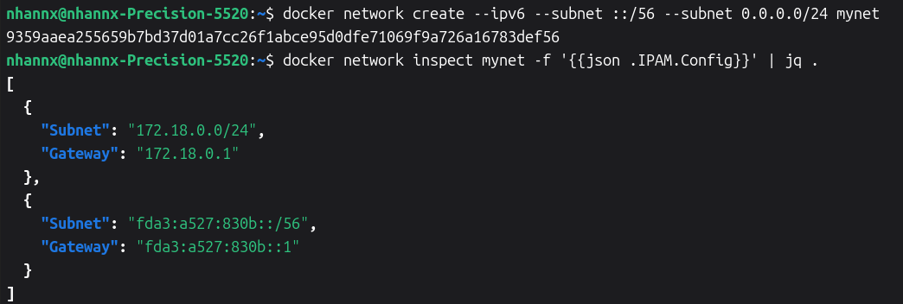

# Networking

Container networking refers to the ability for containers to connect to and communicate with each other, and with non-Docker network services.

[Networking Overview](#1-networking-overview)  
[Docker With iptables](#2-docker-with-iptables)  
[Docker With nftables](#3-docker-with-nftables)  
[Packet Filtering and Firewalls](#4-packet-filtering-and-firewalls)  
[Port Publishing and Mapping](#5-port-publishing-and-mapping)  
[Network Drivers](#6-network-drivers)  
[CA Certificates](#7-ca-certificates)  
[Legacy Container Links](#8-legacy-container-links)  

---

## 1. Networking Overview

Containers have networking enabled by default, and can make outgoing connections. A container has no information about what kind of network it's attached to, or whether its network peers are also Docker containers. A container only sees a network interface with an IP address, a gateway, a routing table, DNS services, and other networking details.

[User-defined Networks](#11-user-defined-networks)  
[Published Ports](#12-published-ports)  
[IP Address and Hostname](#13-ip-address-and-hostname)  
[DNS Services](#14-dns-services)  
[Container Networks](#15-container-networks)  

### 1.1. User-defined Networks

When Docker Engine (Linux) starts for the first time, it has a single built-in network called the "default bridge" network. When running a container without the `--network` option, it is connected to the default bridge. With the default configuration, containers have unrestricted network access to each other using container IP addresses. 

It is useful to separate groups of containers that should have full access to each other, but restricted access to containers in other groups. Containers connect to the same user-defined networks can communicate with each other using container IP addr or container names.

1. Drivers

    Docker Engine (Linux) has a number of network drivers:

    | Driver | Description |
    | :----- | :---------- |
    | bridge | The default network driver. |
    | host   | Remove network isolation between the container and the Docker host. |
    | none   | Completely isolate a container from the host and other containers. |
    | overlay | Swarm Overlay networks connect multiple Docker daemons together. |
    | ipvlan | Connect containers to external VLANs. |
    | macvlan | Containers appear as devices on the host's network. |

2. Connecting to multiple networks

A container can be connected to multiple Docker networks, as well as different types of network.

Containers can also share [networking stacks](#15-container-networks).

When sending packets, if the destination is in a directly connected network, packets are sent to that network. Otherwise, packets are sent to a default gateway for routing to their destination.

The default gateway is selected by Docker. To make Docker choose a specific default gateway, set a gateway priority `gw-priority` (default `0`) for the `docker run` and `docker network connect`.

### 1.2. Published Ports

When a container is created or run, all ports of containers on bridge networks are accessible from the Docker host and others containers connected to the same network.

Use the `--publish` or `-p` flag to make a port available outside the host, and to containers in other bridge networks.

### 1.3. IP Address and Hostname

When creating a network, IPv4 address allocation is enabled by default (disabled `--ipv4=false`). IPv6 address allocation can be enabled using `--ipv6`.

```bash
docker network create --ipv6 --ipv4=false v6net
```

By default, the container gets an IP address for every Docker network it attaches to. The Docker daemon performs dynamic subnetting and IP address allocation. Each network also has a default subnet mask and gateway.

A running container can connect to multiple networks, by passing `--network` flag when creating the container, or using `docker network connect` command.

A container's hostname defaults to be the container's ID. Overiding the hostname using `--hostname`. When connecting to an existing network, use `--alias` to specify alias for the container on that network.

**Subnet Allocation**

Docker networks can use either explicitly configured subnets or automatically allocated ones from default pools.

***Explicit Subnet Configuration***

Specify exact subnets when creating a network:

```bash
docker network create --ipv6 --subnet 192.0.2.0/24 --subnet 2001:db8::/64 mynet
```

***Automatic subnet allocation***

When no `--subnet` option is provided, Docker automatically selects a subnet from predefined "default address pools", configured in `/etc/docker/daemon.json`

```json
{
  "default-address-pools": [{ "base": "172.17.0.0/16", "size": 24 }]
}
```
- `base`: the subnet that can be allocated from
- `size`: the prefix length used for each allocated subnet.

Using `--subnet` option with unspecified addresses to request a subnet with a specific prefix length.



### 1.4. DNS Services

Containers use the same DNS servers as the host by default, but you can override this with `--dns`.

DNS setting is defined in `/etc/resolv.conf`. Containers attach to default bridge network receive a copy of this file.

Containers that attach to a custom network use **Docker's embedded DNS server** with address `127.0.0.11`. 


### 1.5. Container Networks

The two or more containers using the same network namspace.

The flag: `--network container:<name|id>`.

```bash
docker run -d --name redis redis --bind 127.0.0.1

docker run --rm -it --network container:redis redis redis-cli -h 127.0.0.1
```

## 2. Docker With iptables

Docker uses `iptables` to manage network traffic and enforce security between containers and the outside world.

### 2.1. Docker and iptables chains

## 3. Docker With nftables

## 4. Packet Filtering and Firewalls

## 5. Port Publishing and Mapping

## 6. Network Drivers

## 7. CA Certificates

## 8. Legacy Container Links