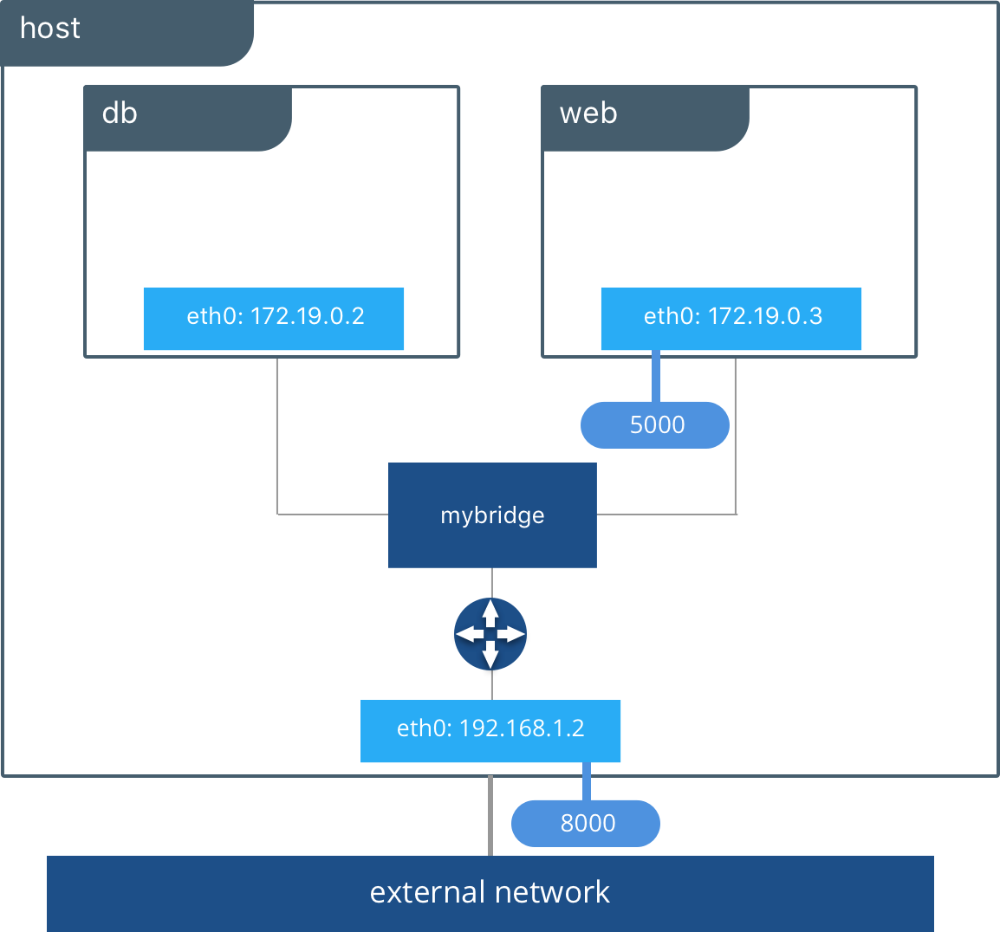
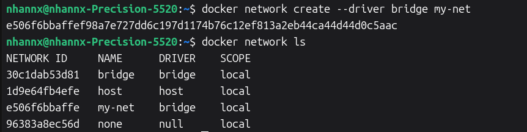
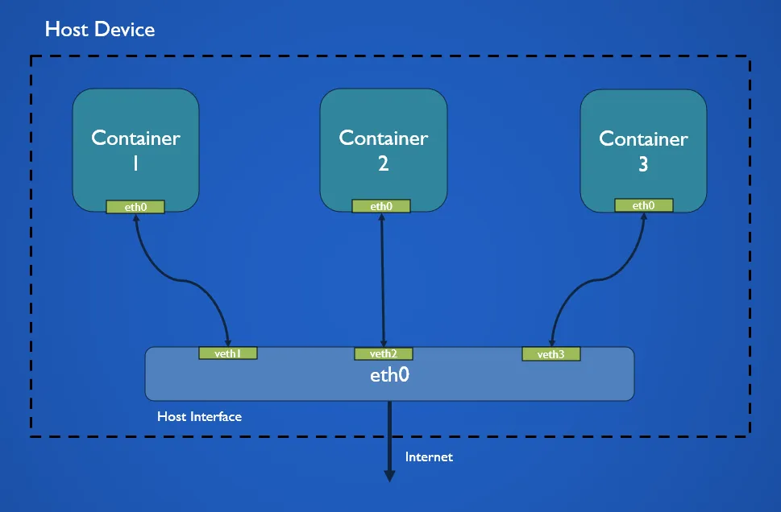

# Netwrok Driver

Network driver is a component of Docker's networking subsystem providing specific networking functionality for containers.  
Docker's networking is pluggable, meaning different types of network connectivity can be achieved by using different drivers. 

---

### 1. Bridge

`bridge` is the default network driver, uses a software bridge which lets containers connected to the same bridge network communicate, while providing isolation from containers that aren't connected to that bridge network. 



1. **Key features**

- Each container connected to a bridge network gets an interface with an IP addr allocated from the network's subnet.

- Containers attached to the same bridge network have unrestricted access to each others, and to the host machine.

- Access from containers on other networks or from external hosts is blocked by default.

- Containers use source NAT (masquerading) through the hosts IP addr to access external networks.

- External networks can access container ports if they are published using the `-p` or `--publish` flag.

- Due to Linux kernel constraints, a single bridge network may become unstable and drop inter-container communication when 1,000 or more containers are attached to it.

2. **User-defined bridge**

    Docker automatically creates a default `bridge` network upon daemon startup, but u**ser-defined bridge networks** are strongly recommended for production applications.

    | Feature | Default Bridge | User-Defined Bridge |
    |---|---|---|
    | DNS Resolution | No auto DNS; containers must connect by IP addr | Auto DNS allows containers to connect using containers name/alias.
    | Isolation | Unassigned containers attach here by default | Ensure only containers on the same user-defined network can communcicate. 
    | Flexibility | Detaching requires container to be stopped and recreated | Containers can be connected or disconnect on the fly.
    | Configuration | Changes apply globally to all containers and require restarting Docker | Each network can be configured with custom MTU, subnets, and IP ranges upon creation. |

3. Basic commands

- Create a bridge network: `docker network create --driver bridge my-net`

    

- Run a container on the network: `docker run -dit --name app1 --network my-net alpine`

- Connect an existing container to a network: `docker network connect my-net app1`

- Disconnect a container: `docker network disconnect my-net app1`

- Remove a network: `docker network rm my-net`

---

### 2. Host Network Driver

**Host network** shares the host's network with the container. When using this driver, the container's network isn't isolated from the host.

Since the container shares the host's networking namespace, the container's ip-address is not allocated, but use ip of the host. When binding to a port, container is available on the same port on the host's IP.

Though network isolation is removed, other isolation remains



#### 2.1. Support and Requirements

- Linux

- Docker Desktop 4.34 and further 

- Swarm Mode: Supported for swarm services `docker service create --network host`. Only one service container can run per Swarm node if it binds to a specific port.

#### 2.2. Usecases

- Bypass NAT

- Container needs to listen on a wide range of ports (without mapping each port)

#### 2.3. Limitations

- Port conflicts: Multiple containers using the same host cannot bind to the same host port at the same time.

- Only Linux containers are supported.

- Host networking on Docker Desktop operates at L4 (TCP/UDP).

- Host Interfaces

#### 2.4. Usages

1. Create a container

```bash
$ docker run --rm -d --network host --name my_nginx nginx

>> 851ab0bdafc0051b616b75556339f0cc27e64fe0b2dc0973f393367f09df4b67
```

2. Access Nginx by browsing to http://localhost:80/

3. Verify which process is bound to port 80 using `netstat`

```bash
$ sudo netstat -tulpn | grep :80
>> tcp        0      0 0.0.0.0:80              0.0.0.0:*               LISTEN      1930/nginx: master  
>> tcp6       0      0 :::80                   :::*                    LISTEN      1930/nginx: master  
>> udp        0      0 127.0.0.1:803           0.0.0.0:*                           1899/rpc.statd    
```

---

### 3. MacvLan Network Driver

Docker daemon routes traffics to containers by MAC addr. Macvlan networks allow assigning a MAC address to a container, making it appear as a physical device on your network. 


<!-- ### 3.1. Support and Requirements

- MacvLan driver works only on Linux hosts.

- MacvLan driver is not supported in rootless mode. -->

---

### 4. IPvLan Network Driver

The IPvlan driver gives users total control over both IPv4 and IPv6 addressing.

---

### 5. Overlay Network Driver

