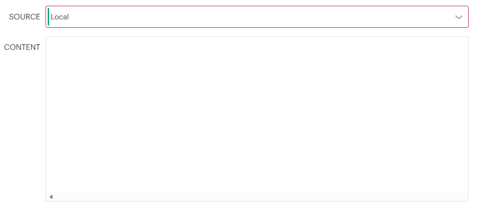
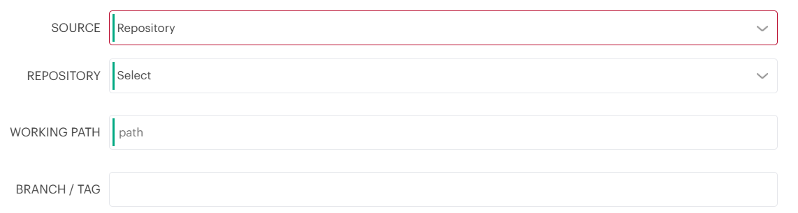
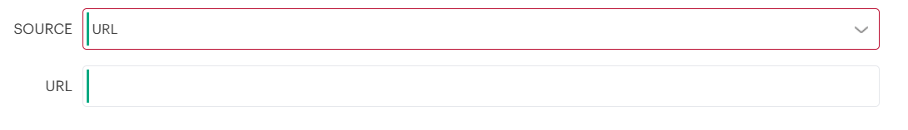
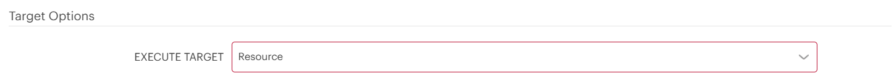
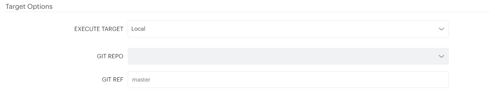
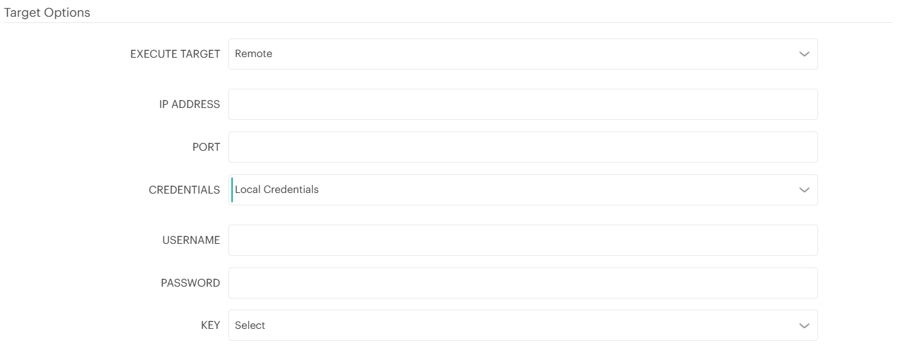
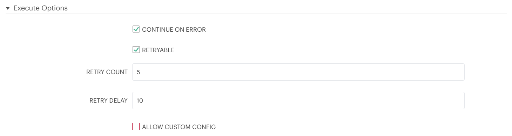
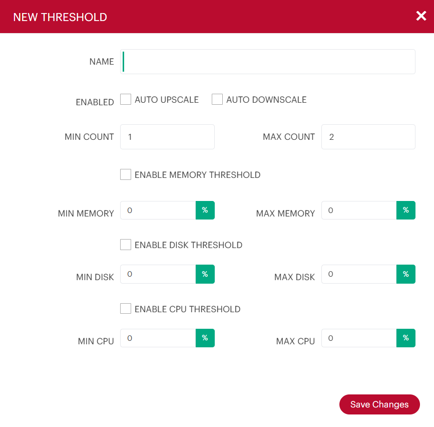
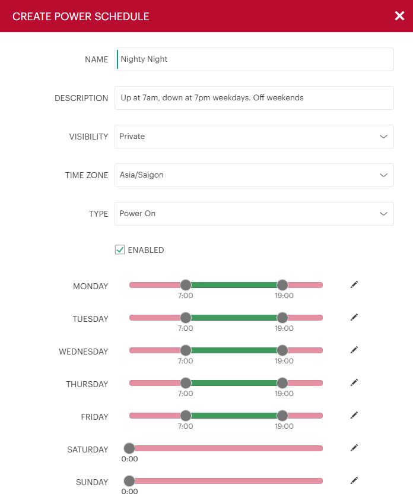
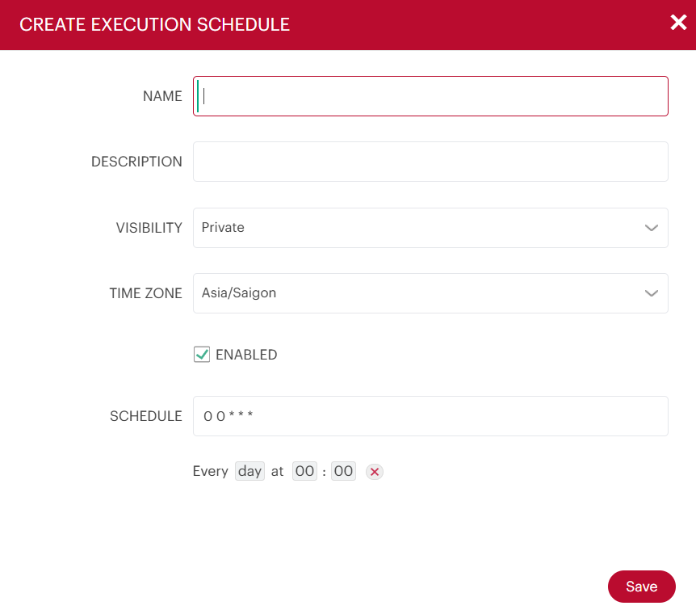

# Library

In Morpheus, the **Library** serves as the repository for managing all reusable components used for resource provisioning, application design (Blueprints), automation, and self-service interface customization.

[1. Automation](#1-automation)  
[2. Blueprints](#2-blueprints)  
[3. Virtual Images](#3-virtual-images)  
[4. Options](#4-options)  
[5. Templates](#5-templates)  
[6. Integrations](#6-integrations)  
[7. Operating Systems](#7-operating-systems)  
[8. Additional Concepts](#8-additional-concepts)  
[9. Labs](#9-labs)

---
### 1. Automation

The **Automation** section is composed of Tasks and Workflows. 

#### 1.1. Tasks

Tasks are primarily created for use in Workflows, but a single Task can be executed on an existing instance via [Actions > Run Task]().

When creating a Task, the required and optional inputs vary by the [Task Types](https://support.hpe.com/hpesc/public/docDisplay?docId=sd00008433en_us&page=GUID-7FAD1058-65F1-409A-9BF8-16AFA4A5C9D6.html). However, there are options which are common to Tasks of all types.

**Source Options**

Task configuration code may be entered in a number of ways:

- Local: Configuration code is written directly in Morpheus in a large text area.

	

- Repository: Source the Task configuration code from an integrated Git or Github repository.

	

- URL: Task configuration that can be source via an outside URL.

	

**Target Options** 

Users can select a target when creating a task to perform the execution:

  - Resource: An Instance or server is selected to execute the task.

	

  - Local: The Task is executed by the Morpheus appliance node.

	

  - Remote: User specifies a remote box which will execute the task.

	

**Execute Options**

- Continue on Error: Workflows containing this Task will continue and will remain in a successful state if this Task fails.

- Retryable: Task can be configured to be retried in the event of failure.

- Retry Count: The maximum number of times the Task will be retried when there is a failure. 

- Retry Delay: The length of time (seconds) Morpheus will wait to retry the Task.

- Allow Custom Config: Extra variables or specify extra configuration could be passed at execution time.

#### 1.2. Workflows

**Workflows** are groups of Tasks.

**Operational Workflows** can be run on-demand against an existing Instance/Server. Additionally, they can be scheduled to run through Morpheus Jobs ([Provisioning > Jobs]()).

**Provisioning Workflows** are associated with Instances at provision time or after through the Actions menu on the Instance detail page. Provisioning Workflows assign Tasks to various stages of the Instance lifecycle, such as Provision, Post Provision, and Teardown.

#### 1.3. Scale Thresholds

Scale Thresholds are pre-configured settings for auto-scaling Instances. When adding auto-scaling to an instance, existing Scale Thresholds can be selected to determine auto-scaling rules.

| Field | Description |
| :---- | :---------- | 
| AUTO UPSCALE/DOWNSCALE | Automatically upscale/downscale per Scale Threshold specifications | 
| MIN/MAX COUNT | Min/Max node count for Instance. Not downscale below MIN COUNT. Not upscale past MAX COUNT |
| ENABLE MEMORY/DISK/CPU THRESHOLD | Set auto-scaling by specified memory/disk/cpu utilization threshold (%) |
| MIN/MAX MEMORY/DISK/CPU | MIN/MAX (%) for triggering downscaling/upscaling |

#### 1.4. Power Scheduling

- Set weekly schedules for shutdown and startup times for Instances and VM’s.

- Apply Power Schedules to Instances pre or post-provisioning.

- Apply Power Schedule policies on Group or Clouds.

- Automatically recommend and apply optimized Power Schedules.

#### 1.5. Execute Scheduling

Execute Scheduling creates time schedules for Jobs (Task, Workflow and Backup).

Schedules use CRON expressions, which can easily be created by clicking the corresponding translation.

### 2. Blueprints
### 3. Virtual Images
### 4. Options
### 5. Templates
### 6. Integrations
### 7. Operating Systems
### 8. Additional Concepts

#### 8.1. Labels

Labels are a categorization feature designed to allow easier filtering of list views in Morpheus Library.

### 9. Labs