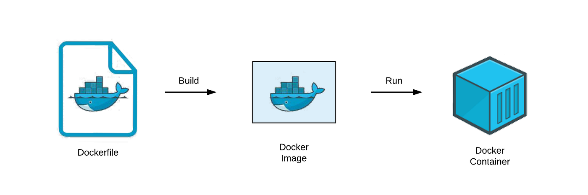

# Dockerfile

### 1. Dockerfile

A **Dockerfile** is a text file containing instructions for building docker images.



**File name**

The default **filename** to use for a Dockerfile is `Dockerfile`, without a file extension. Using the default name allows running the `docker build` command without having to specify additional command flags.

**Dockerfile Syntax**

The first line to add to a Dockerfile is a `# syntax` (parser directive), instructing Docker builder what syntax to use when parsing the docker file.

`# syntax=docker/dockerfile:1`

**Comments**

Comments in Dockerfiles begin with the `#` symbol.  
As Dockerfile evolves, comments can be instrumental to document how Dockerfile works for any future readers and editors of the file.

**Base image**

The `FROM` instruction defines what base image to use.

```yaml
FROM ubuntu:22.04
```

The notation `ubuntu:22.04` follows the `name:tag` standard for naming Docker images.

**Working directory**

The `WORKDIR <directory>` instruction sets the working directory for any `RUN`, `CMD`, `ENTRYPOINT`, `COPY`, and `ADD` instructions that follow it in the Dockerfile.

```yaml
WORKDIR /app
```

**Setup and Installation**

The `RUN` instruction executes any command in a new layer, on top of the current image and commits the result.

```yaml
# install app dependencies
RUN apt-get update && apt-get install -y python3 python3-pip
RUN pip install flask==3.0.*
```

**Coping Files**

`COPY <src> <dest>`  
Copies new files or directories from `<src>` and adds them to the filesystem of the container at the path `<dest>`.

```yaml
COPY hello.py /
```

**Setting environment variables**

The `ENV` instruction set environment variables in Docker build.

```yaml
ENV FLASK_APP=hello
```

**Exposed ports**

```yaml
EXPOSE 8000
```

The `EXPOSE` instruction marks that final image has a service listening on port 8000.

This instruction isn't required, but a good practice and helps tools and team members understand what this application is doing.

**Start the application**

The `CMD` instruction sets the command that is run when the user starts a container based on this image.

```yaml
CMD ["flask", "run", "--host", "0.0.0.0", "--port", "8000"]
```

**Building**

To build a container image using the Dockerfile, use the `docker build` command:

```bash
$ docker build -t test:latest .
```

The `-t test:latest` option specifies the name and tag of the image.

The single dot (`.`) at the end of the command sets the [build context](#2-build-context) to the current directory.

After the image has been built, run the application as a container with `docker run`, specifying the image name:

```bash
$ docker run -p 127.0.0.1:8000:8000 test:latest
```

This publishes the container's port 8000 to `http://localhost:8000` on the Docker host.

### 2. Build context
