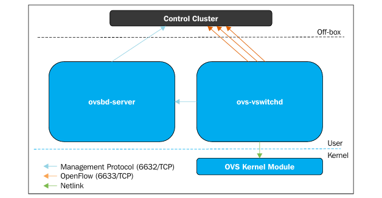
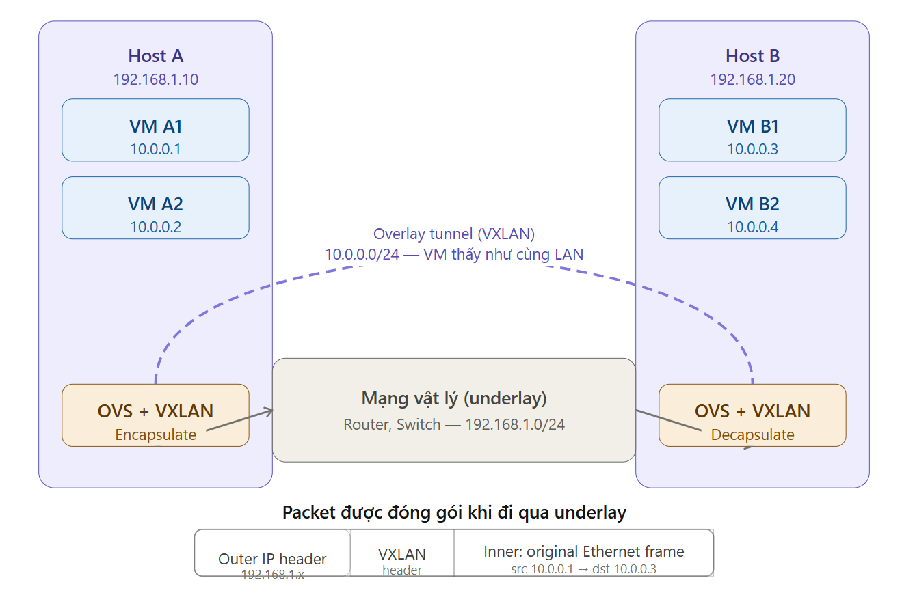

# Open vSwitch

Open vSwitch (OVS) là một switch ảo mã nguồn mở hỗ trợ giao thức OpenFlow, được thiết kế chuyên biệt cho môi trường ảo hóa KVM và điện toán đám mây. OVS được ra đời nhằm thay thế giải pháp Linux Bridge truyền thống vốn chỉ là thiết bị Lớp 2 (Layer 2) cơ bản và thiếu khả năng mở rộng.

### 1. Open vSwitch architecture

Kiến trúc của Open vSwitch tách biệt giữa mặt phẳng dữ liệu (Data Plane) và mặt phẳng điều khiển (Control Plane):



**Open vSwitch kernel module (Data Plane/Datapath)**

OVS Kernel Module được đẩy xuống nằm hoàn toàn ở Kernel Space để đạt tốc độ xử lý gói tin đi vào cao nhất có thể.

* **Chức năng:** Đảm nhận việc xử lý và chuyển tiếp (forwarding) các gói tin thực tế giữa các cổng mạng ảo và cổng vật lý dựa trên bảng luồng được lưu trong bộ đệm tầng nhân (Kernel Datapath cache).

* **Cơ chế Fastpath / Slowpath:**

  * **Gói tin đầu tiên (Slowpath):** Khi một luồng gói tin mới đi vào, do chưa có quy tắc khớp sẵn trong bộ đệm của nhân (Datapath flow cache), gói tin sẽ được chuyển lên tiến trình `ovs-vswitchd` ở User Space thông qua Netlink socket để tìm quy tắc xử lý.

  * **Các gói tin tiếp theo (Fastpath):** Sau khi `ovs-vswitchd` xác định được hành động (action) và cài đặt quy tắc vào Datapath ở tầng nhân, các gói tin tiếp theo thuộc luồng đó sẽ được xử lý và chuyển tiếp trực tiếp ngay trong Kernel Space mà không cần quay lại User Space, giúp giảm thiểu tối đa chi phí chuyển đổi ngữ cảnh (context switch) và độ trễ.

* **Kênh giao tiếp:** Module nhân sử dụng **Netlink socket** để trao đổi dữ liệu hai chiều với tiến trình `ovs-vswitchd`.

**User space tools (Control Plane)**

Control Plane nằm ở không gian người dùng (**User Space**), đóng vai trò là "bộ não" đưa ra các quyết định điều khiển, quản lý cấu hình và thiết lập các quy tắc chuyển mạch.

**Các tiến trình chạy ngầm (Daemons):**

* **ovs-vswitchd** **:**
  * Là tiến trình daemon chính quản lý và thực thi các switch ảo OVS trên hệ thống cục bộ.

  * Tiếp nhận yêu cầu xử lý từ Kernel Datapath qua Netlink socket. `ovs-vswitchd` tra cứu bảng luồng **OpenFlow Flow Table** (được thiết lập bởi SDN Controller hoặc dòng lệnh) để đưa ra quyết định xử lý (Action), tiến trình sẽ cài đặt (install) một quy tắc luồng tương ứng xuống Kernel Datapath.
  
  * Giao tiếp với các Bộ điều khiển SDN từ xa (như OpenDaylight) thông qua giao thức **OpenFlow** (TCP 6633 hoặc 6634) để nhận các quy tắc luồng được đẩy xuống.

* **ovsdb-server** **:**
  * Quản lý cơ sở dữ liệu cấu hình OVSDB (lưu trữ tệp `/etc/openvswitch/conf.db`).
  * Cơ sở dữ liệu này chứa khoảng 13 bảng lưu trữ toàn bộ trạng thái và cấu hình của switch (như Bridge, Port, Interface, QoS, Controller, Mirror...). Cấu hình này được duy trì bền vững qua các lần khởi động lại hệ thống.
  * Giao tiếp với các công cụ quản trị bên ngoài thông qua giao thức JSON-RPC.

**Bộ công cụ dòng lệnh quản trị (CLI Utilities):**

* **ovs-vsctl** **:** Công cụ dòng lệnh giao tiếp với `ovsdb-server` để truy vấn và thay đổi cấu hình switch ở thời điểm thực thi (như tạo/xóa bridge, thêm/bớt cổng, cấu hình VLAN, QoS hay đường hầm VXLAN).

* **ovs-ofctl** **:** Công cụ giao tiếp với module OpenFlow để xem (`dump-flows`), cài đặt hoặc quản lý các bảng luồng OpenFlow ở mặt phẳng điều khiển.

* **ovs-dpctl** **:** Công cụ giao tiếp trực tiếp với Kernel Datapath module để xem thông tin các bridge logic và kiểm tra các luồng dữ liệu đang lưu đệm ở tầng nhân.

* **ovs-appctl** **:** Công cụ gửi lệnh chẩn đoán trực tiếp đến tiến trình `ovs-vswitchd` đang chạy, giúp kiểm tra bảng MAC đã học (`fdb/show`) hoặc điều chỉnh mức độ ghi log VLOG (`vlog/set`) khi chẩn đoán sự cố nâng cao.


### 2. VLAN và VXLAN

**VLAN** và **VXLAN** là hai công nghệ phân tách và ảo hóa mạng:

**VLAN (Virtual Local Area Network)**

* **Cơ chế:** VLAN gắn thêm một thẻ tag ID (từ 1 đến 4094) vào các frame Ethernet. Các cổng trên OVS có thể hoạt động ở chế độ `access` (gán tag khi nhận, gỡ tag khi gửi) hoặc `trunk` (cho phép truyền nhiều VLAN tag qua cùng một đường).

* **Cấu hình trên OVS:**
  * Chế độ Access (VLAN 10): `# ovs-vsctl set port fed1 tag=10`

  * Chế độ Trunk (VLAN 20, 30, 40): `# ovs-vsctl set port fed1 trunks=20,30,40`
* **Tích hợp với libvirt:** Libvirt hỗ trợ tính năng `<postgroup>` trong xml mạng ảo, cho phép gán thẻ VLAN từ virt-mangager.

**VXLAN (Virtual eXtensible LAN)**

* **Cơ chế:** VXLAN tạo ra một đường hầm ảo (tunnel) kết nối các switch OVS trên nhiều máy chủ KVM vật lý riêng biệt. Các gói tin L2 của máy ảo được đóng gói vào gói tin UDP L3 để đi qua mạng IP trung gian.

* **Ưu điểm trong KVM:**
  * **Giải quyết vấn đề quá tải host:** Khi một host `KVM1` hết tài nguyên, bạn có thể tạo đường hầm VXLAN nối `KVM1` với `KVM2` để mở rộng mạng riêng sang máy chủ mới mà không cần can thiệp vào hạ tầng switch vật lý.

  * **Độc lập với hạ tầng L2 vật lý:** Giúp các máy ảo trên nhiều Data Center khác nhau giao tiếp L2 trực tiếp như thể đang cắm chung vào một switch logic.

| Tiêu chí | **VLAN ** | **VXLAN ** |
|---|---|---|
| **Bản chất công nghệ** | Phân tách mạng L2 truyền thống bằng cách đính thẻ tag. | Mạng chồng L2 trên nền L3 (**Overlay Network / UDP Tunneling**). |
| **Định danh phân vùng** | **VLAN ID** (12-bit). | **VNI** (VXLAN Network Identifier - 24-bit). |
| **Số lượng phân vùng tối đa** | Tối đa **4.094 VLANs**. | Lên tới **~16,7 triệu VLANs** ($2^{24}$). |
| **Cơ chế đóng gói (Encapsulation)** | Bổ sung **4-byte 802.1Q header** vào khung Ethernet. | Đóng gói toàn bộ khung Ethernet L2 bên trong gói tin **UDP L3**, mặc định sử dụng cổng UDP **4789**. |
| **Phụ thuộc hạ tầng vật lý** | Yêu cầu switch vật lý hỗ trợ và cấu hình đúng các cổng **Trunk/Access**. | Chạy trên hạ tầng mạng IP L3; switch vật lý chỉ cần chuyển tiếp các gói **IP/UDP**. |
| **Thành phần xử lý chính** | Cổng **Access/Trunk** trên Linux Bridge hoặc OVS Bridge. | **VTEP (Virtual Tunnel Endpoint)** chịu trách nhiệm đóng gói/giải đóng gói tại các điểm cuối đường hầm. |
| **Trường hợp sử dụng phù hợp** | Mạng nội bộ quy mô vừa và nhỏ, ít doanh nghiệp/tenant. | Điện toán đám mây quy mô lớn như **OpenStack, CloudStack**, cần cô lập hàng nghìn tenant. |

### 3. Overlay Network

**Overlay Network (Mạng chồng / Mạng phủ)** trong ảo hóa KVM và Open vSwitch (OVS) là kỹ thuật ảo hóa mạng tiêu chuẩn cho phép tạo ra các mạng Layer 2 ảo hoạt động chồng lên hạ tầng mạng Layer 3 vật lý sẵn có.

***Mục đích và Vấn đề giải quyết***

* **Mở rộng mạng ảo linh hoạt:** Cho phép kết nối và mở rộng các phân vùng mạng nội bộ riêng (private networks) giữa nhiều máy chủ KVM khác nhau mà không bị giới hạn bởi hạ tầng switch/router vật lý bên dưới.

* **Tạo Switch ảo phân tán (Distributed Switch):** Khi liên kết các Open vSwitch trên nhiều host vật lý bằng đường hầm overlay, chúng hoạt động như một switch logic thống nhất kết nối tất cả các máy ảo.

**Các giao thức đường hầm (Tunneling Protocols)**

Open vSwitch hỗ trợ nhiều giao thức đường hầm để đóng gói frames:

* **VXLAN (Virtual eXtensible Local Area Network):** Đóng gói khung Ethernet L2 vào các gói tin UDP L3. Mỗi mạng overlay được định danh bằng chỉ số **VNI (VXLAN Network Identifier)**.

* **GRE (Generic Routing Encapsulation):** Đóng gói các khung dữ liệu L2/IP trực tiếp bên trong giao thức IP.

* **Các giao thức khác:** STT (Stateless Transport Tunneling), Geneve, và hỗ trợ mã hóa an toàn qua **IPsec**.

**VTEP (Virtual Tunnel Endpoint)**

* **VTEP** đại diện cho giao diện điểm cuối của đường hầm được tạo trên các switch OVS.

* **Nhiệm vụ:** Chịu trách nhiệm **đóng gói (encapsulation)** các khung Ethernet từ máy ảo gửi đi thành gói tin L3 để truyền qua mạng vật lý, và **giải đóng gói (decapsulation)** các gói tin nhận được để chuyển trả khung Ethernet cho máy ảo đích.

* Nhờ VTEP, hai máy ảo ở hai máy chủ vật lý riêng biệt có thể giao tiếp L2 trực tiếp với nhau như thể đang cắm chung một switch.

**Use Case**



### 4. SDN Controller

**Bộ điều khiển SDN (SDN Controller)** là thành phần phần mềm trung tâm đóng vai trò như "bộ não" điều hành user kernel space của một hoặc nhiều switch trong kiến trúc mạng ảo hóa. Điểm mấu chốt của SDN là sự **tách biệt hoàn toàn giữa control plane và data/forwarding plane**. Việc tập trung hóa control plane về mặt logic giúp trừu tượng hóa toàn bộ hạ tầng phần cứng bên dưới, cho phép quản trị viên lập trình và điều chỉnh hoạt động của mạng thông qua phần mềm.

**Chuẩn giao tiếp APIs: Southbound và Northbound**

* **Giao tiếp Southbound (Hướng Nam):** Là kênh giao tiếp giữa SDN Controller và các thiết bị chuyển mạch (switch vật lý hoặc switch ảo như Open vSwitch). Bộ điều khiển sử dụng các giao thức mở như **OpenFlow** (TCP 6633) và **OVSDB** (TCP 6632) để truy vấn cấu hình và đẩy các quy tắc xử lý gói tin (flow rules) xuống switch.

* **Giao tiếp Northbound (Hướng Bắc):** Cung cấp giao diện lập trình trừu tượng **REST APIs** hướng lên các ứng dụng quản lý cấp cao (như OpenStack hay ứng dụng dịch vụ mạng). Nhờ các API này, các ứng dụng có thể tự động yêu cầu điều tiết mạng (như ưu tiên băng thông QoS, phân tách VLAN) một cách linh hoạt theo nhu cầu thực tế.

**Quy trình xử lý luồng gói tin (Slowpath vs. Fastpath)**

* **Gói tin đầu tiên (Slowpath):** Khi một luồng gói tin mới đi vào switch và chưa có quy tắc khớp trong bảng luồng, gói tin sẽ được gửi qua đường Slowpath lên SDN Controller để bộ điều khiển tính toán định tuyến và ra quyết định xử lý[10].
* **Các gói tin tiếp theo (Fastpath):** Sau khi bộ điều khiển tính toán xong và cài đặt (install) quy tắc vào bảng luồng (Flow Table) của switch, tất cả các gói tin tiếp theo thuộc luồng đó sẽ xử lý trực tiếp trên đường Fastpath tại datapath của switch mà không cần gửi lại lên controller[10].
* **Cấu trúc một quy tắc luồng (Flow Entry):** Mỗi quy tắc luồng do controller đẩy xuống gồm 3 thành phần chính: bộ điều kiện khớp (**Rule/Match** từ L2 đến L4), hành động (**Action** như forward, drop, modify), và trình đếm thống kê (**Stats**), kèm theo các tham số thời gian chờ **idle\_timeout** và **hard\_timeout**[10][11].

**Bộ điều khiển OpenDaylight (ODL)**

* Trong môi trường KVM và Open vSwitch, **OpenDaylight (ODL)** được xem là bộ điều khiển SDN mã nguồn mở phổ biến và là tiêu chuẩn thực tế của ngành.

* OpenDaylight tự động phát hiện cấu trúc mạng và các cổng kết nối bằng giao thức LLDP, cung cấp bảng điều khiển trực quan (Dashboard) cũng như REST API giúp quản trị viên dễ dàng quản lý và cài đặt các luồng OpenFlow cho switch.

### 5. Open vSwitch - controller connection modes

Trong Open vSwitch (OVS), việc kết nối giữa switch ảo và Bộ điều khiển SDN (SDN Controller) có thể được cấu hình qua nhiều chế độ và hình thức kết nối khác nhau tùy thuộc vào kiến trúc hạ tầng và yêu cầu bảo mật.

**Phương thức &amp; Giao thức target kết nối (** **set-controller** **)**

Khi thiết lập địa chỉ kết nối tới bộ điều khiển bằng lệnh `ovs-vsctl set-controller <bridge> <target>`, OVS hỗ trợ các dạng **target** sau:

* **Chủ động (Active Mode):** OVS đóng vai trò client chủ động kết nối tới bộ điều khiển SDN.
  * **tcp:ip[:port]** **:** Kết nối truyền thông qua giao thức TCP không mã hóa (mặc định cổng OpenFlow thường là `6633` hoặc `6634`).
  * **ssl:ip[:port]** **:** Kết nối mã hóa an toàn qua **SSL/TLS** bằng chứng chỉ số CA.
  * **unix:file** **:** Kết nối cục bộ thông qua socket tệp UNIX domain trên chính máy chủ.
* **Thụ động (Passive Mode):** OVS đóng vai trò server lắng nghe kết nối từ bộ điều khiển[2].
  * **ptcp:[port][:ip]** **:** Lắng nghe kết nối TCP thụ động[2].
  * **pssl:[port][:ip]** **:** Lắng nghe kết nối SSL thụ động[2].

**Hai chế độ vận hành chính (Switch Operating Modes)**

OVS có hai chế độ vận hành tổng thể khi làm việc với bộ điều khiển:

* **Flow Mode (Chế độ bảng luồng SDN):**
  * Quyết định chuyển tiếp gói tin hoàn toàn dựa trên bảng luồng (Flow Table) do bộ điều khiển SDN đẩy xuống thông qua giao thức OpenFlow.
  * Gói tin đầu tiên thuộc một luồng mới sẽ đi theo đường **Slowpath** lên bộ điều khiển để học quy tắc, các gói tin tiếp theo sẽ được xử lý cực nhanh ở đường **Fastpath** trong nhân (Kernel Datapath).
* **Normal Mode (Chế độ tự học L2):**
  * OVS tự đảm nhận toàn bộ chức năng chuyển mạch/chuyển tiếp gói tin như một switch học địa chỉ MAC L2 tiêu chuẩn mà không cần sự can thiệp của bộ điều khiển bên ngoài.

**Chế độ xử lý khi mất kết nối Controller (Fail Modes)**

Khi đường truyền giữa OVS và SDN Controller bị gián đoạn, OVS cung cấp hai chế độ **Fail Mode** để kiểm soát hành vi chuyển mạch:

* **Standalone Mode (Chế độ mặc định):**
  * Nếu mất kết nối tới bộ điều khiển, OVS tự động chuyển sang cơ chế **Normal Mode** (switch L2 tự học).
  * Cơ chế này giúp đảm bảo mạng không bị ngắt hoàn toàn và các máy ảo vẫn có thể duy trì giao tiếp Layer 2 thông thường.\

* **Secure Mode:**
  * OVS sẽ **không** tự động chuyển về switch L2 thông thường khi mất kết nối.
  * OVS tiếp tục thực thi các quy tắc luồng (flows) hiện có hoặc hủy (drop) các gói tin không khớp quy tắc cho đến khi kết nối tới bộ điều khiển SDN được khôi phục.

### 6. OpenvSwitch Command

**Open vSwitch Daemon Commands**

- Dùng để điều khiển toàn hệ thống OVS.
- Công cụ chính: ovs-vsctl (tương tác với ovs-vswitchd).
- Hiển thị toàn bộ bridge, port, interface trong OVS.

```bash
# Kiểm tra cấu hình hiện tại
sudo ovs-vsctl show
```

**Bridge Commands**

- Dùng để quản lý virtual switch (bridge).

```bash
# Tạo bridge mới
sudo ovs-vsctl add-br br0

# Xóa bridge
sudo ovs-vsctl del-br br0

# Xem danh sách bridge
sudo ovs-vsctl list-br
```

**Port Commands**

- Quản lý cổng (port) được gắn vào bridge.

```bash
# Thêm port vật lý ens33 vào br0
sudo ovs-vsctl add-port br0 ens33

# Thêm port nội bộ (internal)
sudo ovs-vsctl add-port br0 br0-int -- set interface br0-int type=internal

# Xóa port
sudo ovs-vsctl del-port br0 ens33

# Liệt kê port của bridge
sudo ovs-vsctl list-ports br0
```

**Interface Commands**

- Quản lý interface gắn với port.

```bash
# Liệt kê tất cả interfaces
sudo ovs-vsctl list interface

# Xem chi tiết interface cụ thể
sudo ovs-vsctl list interface ens33
```

**Database Commands**

- OVS sử dụng `ovsdb-server` để lưu trữ cấu hình trong dạng database.

- Các table chính: `Bridge`, `Port`, `Interface`, `Open_vSwitch`, `Flow_Table`...

```bash
# Liệt kê tất cả bảng trong database
sudo ovs-vsctl list-tables

# Liệt kê record trong bảng Bridge
sudo ovs-vsctl list Bridge

# Hiển thị chi tiết record theo cột
sudo ovs-vsctl list interface name,type

# Tìm kiếm record có name=br0 trong bảng Bridge
sudo ovs-vsctl find Bridge name=br0
```   