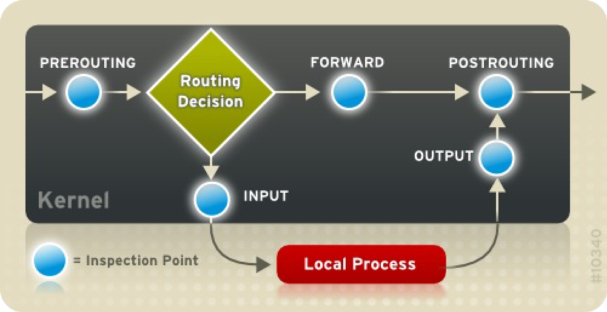

# IPTables

Packet filtering refers to the process of controlling network packets as they enter, move through, and exit the network stack within the kernel.  
**Iptables** (also called netfilter) is a command-line tool for filtering network packets.

## 1. Packet Filtering

The Linux kernel uses the **Netfilter** to filter packets, allowing some of them to be received by or pass through the system while stopping others. 

This facility has five built-in `tables`:

| Tables | Decription |
| :----- | :--------- |
| filter | The default, allow or block traffic. |
| nat | Used to alter packets that create a new connection and used for NAT. |
| mangle | Used for change packet headers, marks, TTL, QoS-related processing. |
| raw | Used mainly for excluding packets from connection tracking. |
| security | Used for Mandatory Access Control (MAC) networking rules. |

Each table has a group of built-in **chains**. 
x
**Chains** is a sequential rules which correspond to the actions performed on the packet by netfilter.

**The built-in chains for the `filter` table are as follows:**

| Chains | Description | 
| :----- | :---------- |
| INPUT | Applies to network packets that are targeted for the host. |
| OUTPUT | Applies to locally-generated network packets. |
| FORWARD | Applies to network packets routed through the host. |

**The built-in chains for the `nat` table are as follows:**

| Chains | Description | 
| :----- | :---------- |
| PREROUTING | Applies to network packets when they arrive. |
| OUTPUT | Applies to locally-generated network packets before they are sent out. |
| POSTROUTING |  Applies to network packets before they are sent out. |

**The built-in chains for the `mangle` table are as follows:**

| Chains | Description | 
| :----- | :---------- |
| INPUT | Applies to network packets targeted for the host. |
| OUTPUT | Applies to locally-generated network packets before they are sent out. | 
| FORWARD | Applies to network packets routed through the host. |
| PREROUTING |  Applies to incoming network packets before they are routed. |
| POSTROUTING | Applies to network packets before they are sent out. |

**The built-in chains for the `raw` table are OUTPUT and PREROUTING.**

**The built-in chains for the security table are INPUT, OUTPUT, and FORWARD.**



## 2. Struture of IPTables Command

IPTables commands have the following structure:

```bash
iptables [-t <table-name>] <command> <chain-name> \
<parameter-1> <option-1> \
<parameter-n> <option-n>
```

- The `<table-name>` specifies which table the rule applies to. If omitted, the filter table is used.

- `<command>` specifies the action to perform, such as appending or deleting a rule.

- `<chain-name>` specifies the chain to edit, create, or delete.

- `<parameter>-<option>` pairs — Parameters and associated options that specify how to process a packet that matches the rule.

### 2.1. Command Options

Command options instruct iptables to perform a specific action. 

| Option | Description | Example |
|---|---|---| 
| `-A`, `--append` | Append a rule to the end of the chain. | `iptables -A INPUT ...`
| `-D`, `--delete` | Delete a rule by its number `<interger>` or by its exact `<rule>` specification. | `iptables -D INPUT --dport 80 -j DROP`, `iptables -D INPUT 1` |
| `-E`, `--rename-chain` | Rename a user-defined chain. Built-in chains cannot be renamed. | `iptables -E allowed disallowed` |
| `-F`, `--flush` | Deleting all rules. If no chain is specified, all chains are flushed. | `iptables -F INPUT` |
| `-I`, `--insert` | Insert a rule at a specified `<interger>` position. If no position is given, the rule is inserted at the top. | `iptables -I INPUT 1 --dport 80 -j ACCEPT` |
| `-L`, `--list` | List rules in a chain. If no chain/table is specified, lists rules in `filter` table. | `iptables -L INPUT` |
| `-N`, `--new-chain` | Create a new user-defined chain. | `iptables -N allowed` |
| `-P`, `--policy` | Set the default policy for a chain, `ACCEPT` or `DROP`, when no rule matches. | `iptables -P INPUT DROP` |
| `-R`, `--replace` | Replace an existing rule. The rule number `<interger>` must be specified. | `iptables -R INPUT 1 -s 192.168.0.1 -j DROP` |
| `-X`, `--delete-chain` | Delete a user-defined chain. Built-in chains cannot be deleted. | `iptables -X allowed` |
| `-Z`, `--zero` | Zero the packet and byte [counters](../references/counter.md) for all chains in a table. |

**Important**: Only one command option can be used per `iptables` command and the order of rules matters since `iptables` processes rules sequentially.

```bash
iptables -A INPUT -p tcp --dport 22 -j ACCEPT
```

### 2.2. Parameter Options

IPTables commands require various **parameters** to construct a packet filtering rule.

1. **Matches**

    | Option | Description |
    |---|---|
    | `-p`, `--protocol` | Set the protocol affected by the rule (`tcp`, `udp`, `icmp`). If omitted, it defaults to `all`. |
    | `-s`, `--src`, `--source` | Check the source hostname, IP address, or network. |
    | `-d`, `--dst`, `--destination` | Check the destination hostname, IP address, or network. |
    | `-i`, `--in-interface` | Specifies the incoming network interface. Supports `!` to exclude interfaces and `+` as a wildcard (`eth+`). |
    | `-o`, `--out-interface` | Set the outgoing network interface. Supports the same options as `-i`. |
    | `-f`, `--fragment` | Rule only to fragmented packets. Use `! -f` to match only unfragmented packets. |

2. **TCP Protocol Matches**

    | Option | Description | Example |
    |---|---|---|
    | `--sport`, `--source-port` | Matches the source port. Supports service names, port numbers, or ranges. | `-p tcp --sport 1024:65535` |
    | `--dport`, `--destination-port` | Matches the destination port. Can use a service name, port number, or port range. | `-p tcp --dport 22` |
    | `--syn` | Matches TCP SYN packets, which are normally used to initiate a TCP connection. | `-p tcp --syn` |
    | `--tcp-flags` | Matches packets based on specific TCP flags. | `--tcp-flags ACK,FIN,SYN SYN` |

    Port ranges: Use `:` to specify a range (valid range 0:65535)

    ```bash
    -p tcp --dport 3000:3200
    ```

    Use `!` to reverse the match:

    ```bash 
    # Matches TCP packets whose destination port is not 22.
    -p tcp ! --dport 22
    ```

3. **UDP Protocol Matches**
    `--dport` and `--sport``, which is similar to TCP Protocol Matches.

4. **ICMP Protocol Matches**

    | Option | Description | Example |
    |---|---|---|
    | `--icmp-type` | Matches a specific ICMP message type by name or number. | `-p icmp --icmp-type echo-request` |
    
5. **Target Matches**

    A **target** determines what action `iptables` takes after a packet matches a rule. 

    ```bash
    iptables -A <CHAIN> <MATCH> -j <TARGET>
    ```

    | Option | Description |
    |---|---|
    | `-j`, `--jump` | Jumps to the specified target when a packet matches the rule. Can also jump to a user-defined chain. <br> If no target is specified, the packet moves past the rule with no action taken. |

    Standard Targets:

    | Target | Description |
    |---|---|
    | `<user-defined-chain>` | Sends the packet to a specified user-defined chain for further rule processing. The chain name must be unique. |
    | `ACCEPT` | Allows the packet to continue to its destination or to another chain. |
    | `DROP` | Discards the packet without sending a response to the sender. |
    | `REJECT` | Drops the packet and sends an error response to the sender. Only works with `INPUT`, `FORWARD`, `OUTPUT`. |
    | `QUEUE` | Sends the packet to a user-space application for processing. |
    | `RETURN` | Stops processing the current chain and returns to the calling chain. If used in a built-in chain with no calling chain, the chain's default policy is applied. |
    | `LOG` | Logs packets that match the rule. |

6. **Listing Options**

    Listing options are mainly used with `iptables -L` to display detailed information about firewall rules.

    | Option | Description | Example |
    |---|---|---|
    | `-v` | Verbose output. Displays additional information such as packet/byte counters and network interfaces. | `iptables -L -v` |
    | `-x` | Displays exact values for packet and byte counters instead of abbreviated values such as K, M, or G. | `iptables -L -x` |
    | `-n` | Displays IP addresses and port numbers numerically instead of resolving hostnames and service names. | `iptables -L -n` |
    | `--line-numbers` | Displays the rule number for each rule in a chain. | `iptables -L --line-numbers` |
    | `-t <table-name>` | Specifies which table to list. If omitted, the `filter` table is used. | `iptables -L -t nat` |

## 3. Saving IPTables Rules

Rules created with the iptables command are stored in memory.  
To save netfilter rules, run the following command as root:

```bash
$ service iptables save
```

This runs the `iptables-save` program and writes the current iptables configuration to `/etc/sysconfig/iptables`. The existing `/etc/sysconfig/iptables` file is saved as backup `/etc/sysconfig/iptables.save`.

When the system boots, the iptables init script reapplies the rules saved in `/etc/sysconfig/iptables` by using the `iptables-restore` command.

## 4. IPTables Control Scripts

- `service iptables start`:  If a firewall is configured, all running iptables are stopped completely and then started using the `iptables-restore` command. 

- `service iptables stop`: The firewall rules in memory are flushed, and all iptables modules and helpers are unloaded.

- `service iptables restart`: The firewall rules in memory are flushed, and the firewall is started again if it is configured in `/etc/sysconfig/iptables`.  

- `service iptables status`: Displays the status of the firewall and lists all active rules.

- `service iptables panic`: Flushes all firewall rules. The policy of all configured tables is set to `DROP`.

- `service iptables save`: Saves firewall rules to `/etc/sysconfig/iptables` using `iptables-save`. 

## 5. IPTables and IPSets

The ipset utility is used to administer IP sets in the Linux kernel. An IP set is a framework for storing IP addresses, port numbers, IP and MAC address pairs, or IP address and port number pairs.

IP sets enable simpler and more manageable configurations as well as providing performance advantages when using `iptables`. 

```bash
$ iptables -A INPUT -s 10.0.0.0/8 -j DROP
$ iptables -A INPUT -s 172.16.0.0/12 -j DROP
$ iptables -A INPUT -s 192.168.0.0/16 -j DROP
```

The set is created and then referenced in an `iptables` as follows: 

```bash
$ ipset create my-block-set hash:net
$ ipset add my-block-set 10.0.0.0/8
$ ipset add my-block-set 172.16.0.0/12
$ ipset add my-block-set 192.168.0.0/16

$ iptables -A INPUT -m set --set my-block-set src -j DROP
```