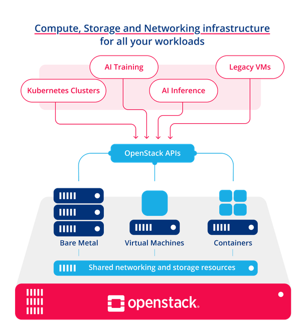
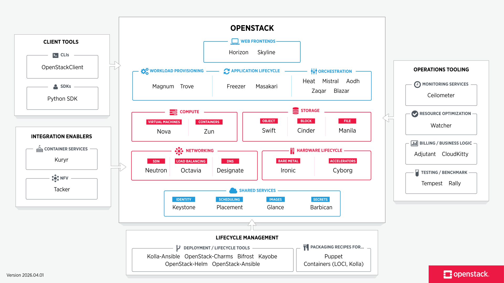

# Openstack 

1. [What is Openstack](#1-what-is-openstack)  
2. [Openstack Landsacpe](#2-openstack-landscape)
3. [Openstack Components](#3-openstack-components)  
4. [Deployment Tools](#4-deployment-tools)

---

### 1. What is Openstack?

OpenStack is a cloud operating system that controls large pools of compute, storage, and networking resources throughout a datacenter, all managed and provisioned through APIs with common authentication mechanisms.

Additional components provide orchestration, fault management and service management, providing operators flexibility to customize their infrastructure and ensure high availability of user applications.

---

### 2. Openstack Landscape

OpenStack’s modular framework allows identifing and deploying components depending on customer's needs. 

The OpenStack map gives a high level overview of the OpenStack landscape to see where those services fit and how they can work together.

---

### 3. Openstack Components

An OpenStack deployment contains a number of components providing APIs to access infrastructure resources.

#### 3.1. Compute

1. 
Nova

    

    Nova is the OpenStack project that provides a way to provision compute instances (aka virtual servers). Nova supports creating VMs, baremetal servers, and has limited support for system containers. Nova runs as a set of daemons on top of existing Linux servers to provide that service.

    Nova depends on these following OpenStack services for basic function:

    - [Keystone](#keystone): Provide identity and authentication for all OpenStack services.

    - [Glance](#glance): Provide image repository. All compute instances launch from glance images.

    - [Neutron](#neutron): Provision the virtual or physical networks that compute instances connect to on boot.

    - [Placement](#placement): Track inventory of resources available in a cloud and assisting in choosing which provider of those resources will be used when creating a VM.

    It can also integrate with other services to include: persistent block storage, encrypted disks, and baremetal compute instances.

    **Tools for using Nova**

    - [Horizon](#horizon): The official web UI for the OpenStack Project.

    - OpenStack Client: The official CLI for OpenStack Projects.

2. Zun

#### 3.2. Hardware Lifecycle

1. Ironic 

2. Cyborg

#### 3.3. Storage

1. Swift

2. 
Cinder

    

    Cinder is a *Block Storage* service for OpenStack, providing volumes to Nova VMs, Ironic bare metal hosts, containers and more. 

    Cinder virtualizes the management of block storage devices and provides end users with a self service API to request and consume resources without requiring any knowledge of where their storage is actually deployed or on what type of device. (See a [reference implementation (LVM)]() or [plugin drivers]()).

    Dependency: [Keystone](#keystone).

3. Manila

#### 3.4. Networking

1. 
Neutron

    

    OpenStack Neutron is an SDN (Software Defined Network) networking project focused on delivering networking-as-a-service (NaaS) in virtual compute environments. 

    Neutron implements the [OpenStack Networking API](https://docs.openstack.org/api-ref/network/).

    See more at [Openstack Networking Guide](https://docs.openstack.org/neutron/latest/admin/index.html).

    Dependency: [Keystone](#keystone).

2. 
Octavia

    

    Octavia is an open source, operator-scale load balancing solution designed to work with OpenStack, born out of the Neutron LBaaS project.

    Octavia accomplishes its delivery of load balancing services by managing a fleet of virtual machines, containers, or bare metal servers — collectively known as amphorae.

    Dependencies: [Glace](#glance), [Keystone](#keystone), [Neutron](#neutron), [Nova](#nova).

3. Designate

#### 3.5. Shared Services

1. 
Keystone

    

    Keystone is an OpenStack service that provides API client authentication, service discovery, and distributed multi-tenant authorization by implementing [OpenStack’s Identity API](https://docs.openstack.org/api-ref/identity/index.html). It supports LDAP, OAuth, OpenID Connect, SAML and SQL. 

2. 
Placement

    Placement is an OpenStack service that provides an HTTP API for tracking cloud resource inventories and usages to help other services effectively manage and allocate their resources. 

    The types of resources consumed are tracked as **classes**. The service provides a set of standard resource classes (**DISK_GB**, **MEMORY_MB**, and **VCPU**) and provides the ability to define custom resource classes as needed.

3. 
Glance

    

    Glance image services include discovering, registering, and retrieving virtual machine images. 
    
    Glance has a RESTful API that allows querying of VM image metadata as well as retrieval of the actual image. 
    
    VM images made available through Glance can be stored in a variety of locations from simple filesystems to object-storage systems like the OpenStack Swift project. 

    Dependency: [Keystone](#keystone).

4. 
Barbican

    

    Barbican is the OpenStack Key Manager service, providing secure storage, provisioning and management of secret data, such as passwords, encryption keys, X.509 Certificates and raw binary data. 

    Dependency: [Keystone](#keystone).

#### 3.6. Orchestration

#### 3.7. Workload Provisioning

#### 3.8. Application Lifecycle 

#### 3.9. Web Frontends

1. 
Horizon

    

    Horizon is the implementation of OpenStack’s Dashboard, which provides a web based user interface to OpenStack services including Nova, Swift, Keystone, etc.

    Dependency: [Keystone](#keystone).

2. Skyline

### 4. Deployment Tools

Tools and packaging recipes to help install and maintain the lifecycle of OpenStack deployments.

#### 4.1. Frameworks for lifecycle management

1. Kolla-Ansible

    

    Kolla-Ansible deploys a containerised OpenStack control plane using Kolla containers, orchestrated via Ansible. The project aims for simplicity and reliability, while providing a flexible, intuitive configuration model. 

2. Openstack-Ansible

#### 4.2. Packaging recipes for popular frameworks